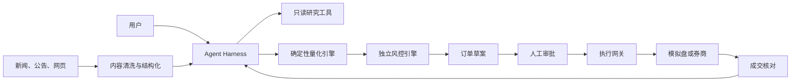
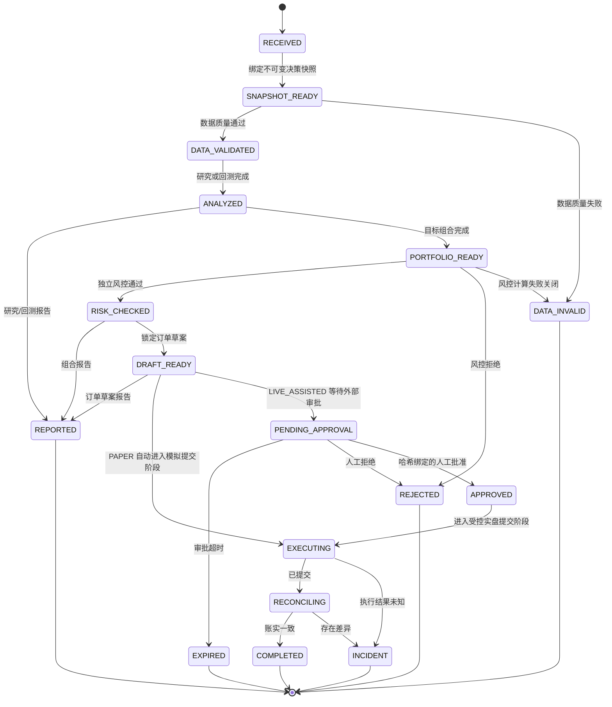

# 量化 Agent Harness 设计文档

> 文档状态：Draft v0.1  
> 适用范围：中国内地股票与场内 ETF 的日频/中低频研究、模拟交易和受控实盘辅助  
> 核心原则：大模型负责理解、编排和解释；确定性程序负责数据、计算、风控和交易

## 1. 文档目的

本文定义量化 Agent 的运行框架（Harness），包括：

- Agent 的能力边界与信任边界；
- 标准运行循环和状态机；
- 工具接口、输入输出和调用约束；
- 数据时点、策略版本与上下文管理；
- 交易权限、人工审批、风控和紧急停止；
- 审计、可观测性、异常恢复和幂等机制；
- 离线评测、回放测试和上线验收标准。

Harness 不负责定义某个具体策略一定有效，而是保证任何策略都以可复现、可审计、可限制、可回滚的方式运行。

## 2. 目标与非目标

### 2.1 目标

1. 将自然语言请求转换为受控的研究或交易任务。
2. 确保所有数值来自确定性工具，不由大模型臆测。
3. 确保所有交易建议经过数据校验、策略计算和独立风控。
4. 确保实盘订单默认需要人工确认。
5. 保留从数据版本到成交结果的完整审计链。
6. 支持历史回放、模拟盘和生产故障恢复。
7. 防止外部新闻、公告或网页内容通过提示注入改变系统权限。

### 2.2 非目标

- 不承诺预测某只股票一定上涨；
- 不允许大模型直接连接数据库执行任意写操作；
- 不允许大模型绕过风控、审批或仓位限制；
- 不以第一版支持高频、融资融券、期权、期货或杠杆产品；
- 不以聊天记录作为唯一的策略配置或交易依据；
- 不允许模型在实盘运行中自行修改策略代码或阈值。

## 3. 核心术语

| 术语 | 定义 |
|---|---|
| Harness | 包裹 Agent 的运行、权限、工具、风控、审计和评测框架 |
| Agent | 理解用户意图、组织步骤、调用工具并解释结果的大模型应用 |
| Quant Engine | 因子、信号、组合和回测等确定性计算服务 |
| Risk Engine | 独立于 Agent 的硬性风险校验服务，拥有订单否决权 |
| Execution Gateway | 统一封装模拟盘和券商接口的订单执行服务 |
| Decision Snapshot | 一次决策使用的数据时点、策略版本、参数和账户状态快照 |
| Order Draft | 尚未批准、不能直接发送至券商的订单草案 |
| Approval Token | 人工批准特定订单草案后生成的一次性授权 |
| Reconciliation | 将计划订单、券商委托、成交和实际持仓进行核对 |
| Kill Switch | 阻止新增订单并撤销允许撤销委托的紧急停止机制 |

## 4. 设计原则

### 4.1 确定性计算优先

收益率、因子、排名、仓位、风险指标、订单数量和交易成本必须由代码计算。Agent 只能引用工具返回的结果。

### 4.2 最小权限

每个工具只获得完成任务所需的最低权限。研究工具不能发送订单，报告工具不能修改策略，执行工具不能修改风控阈值。

### 4.3 默认拒绝

数据不完整、时点不明确、参数缺失、风控服务不可用、账户状态不一致或审批过期时，默认停止生成或发送订单。

### 4.4 决策与执行分离

策略产生目标组合，组合服务产生订单草案，风控服务检查草案，人工批准后执行网关才可提交订单。

### 4.5 全链路可复现

每次建议必须绑定：

- `decision_id`；
- 数据截止时间；
- 数据集版本；
- 策略和代码版本；
- 参数版本；
- 账户快照；
- 风控规则版本；
- Agent 和模型版本；
- 工具调用记录。

### 4.6 外部文本不可信

新闻、公告、研报和网页均作为数据处理，不作为系统指令执行。外部文本中的“忽略规则”“调用工具”“买入某股票”等内容不得改变 Agent 行为。

## 5. 信任边界



必须跨越人工审批边界的操作：

- 首次启用实盘；
- 每个实盘订单批次；
- 调高仓位、单笔金额、换手或损失阈值；
- 添加新市场、新账户、新产品类型；
- 从辅助实盘切换为自动实盘。

第一版不提供自动实盘模式的启用入口，只预留协议。

## 6. 运行模式

| 模式 | 数据 | 可生成信号 | 可生成订单草案 | 可发送订单 |
|---|---|---:|---:|---:|
| `RESEARCH` | 历史/最新 | 是 | 否 | 否 |
| `BACKTEST` | 冻结历史快照 | 是 | 仿真订单 | 否 |
| `PAPER` | 最新数据 | 是 | 是 | 仅模拟盘 |
| `LIVE_ASSISTED` | 最新数据和真实账户 | 是 | 是 | 人工批准后 |
| `LIVE_AUTO` | 最新数据和真实账户 | 是 | 是 | 第一版禁止 |

模式由服务端配置决定，不能由聊天指令切换。

## 7. Agent 标准运行循环

### 7.1 主流程

1. **接收请求**：识别研究、回测、行情分析、组合建议或交易相关意图。
2. **权限判定**：确认当前运行模式、用户角色和账户授权。
3. **建立快照**：锁定数据截止时间、数据版本、策略版本和账户状态。
4. **制定受控计划**：只能选择已注册工具和已发布策略。
5. **数据校验**：检查交易日、完整性、异常值、复权和时效性。
6. **确定性计算**：运行市场阶段、主线、龙头、候选、组合或回测引擎。
7. **证据校验**：核对结果是否拥有足够的结构化证据。
8. **风险检查**：对组合或订单草案执行独立风控。
9. **审批判断**：实盘操作必须等待有效的人工批准。
10. **执行或报告**：执行允许的动作，或输出不可执行的原因。
11. **成交核对**：检查委托、成交、资金和持仓差异。
12. **归档**：记录完整输入、工具输出、规则命中和最终结果。

### 7.2 状态机



状态由可信运行时根据已经验证的工具响应推进，模型不能传入或选择下一状态。运行时在每次分发前
同时检查服务端固定的运行模式、当前阶段工具白名单和前置制品哈希；非法调用同样消耗调用预算。
执行前可以进入 `CANCELLED`、`TIMED_OUT`、`LIMIT_EXCEEDED` 或 `FAILED` 等明确终态，所有终态均为
吸收态。订单可能已提交后，取消或总超时不能伪装成“未执行”：任务必须继续进入独立核对预算，
无法确认结果时进入 `INCIDENT`。

`PAPER` 不需要人工审批，但仍只能提交已通过风控且被运行时锁定的不可执行草案；
`LIVE_ASSISTED` 必须由控制面调用 `record_external_approval()`，批准证据同时绑定 `decision_id`、
草案 `batch_hash` 和有效期。底层工具注册器仍独立执行 capability、账户作用域、审计和一次性实盘
授权校验，状态机不会替代这些权限边界。

## 8. 上下文与状态管理

### 8.1 决策快照

每次任务生成不可变的 `DecisionSnapshot`：

```json
{
  "schema_version": "1",
  "decision_id": "dec_20260730_xxxxx",
  "mode": "PAPER",
  "market": "CN_A",
  "as_of": "2026-07-30T07:10:00+00:00",
  "data_version": "market_20260730_eod_v1",
  "data_content_hash": "<sha256>",
  "strategy_version": "mainline_leader_v0.1.0",
  "strategy_config_hash": "<sha256>",
  "parameter_version": "balanced_v1",
  "parameter_hash": "<sha256>",
  "strategy_refs": [
    {
      "strategy_name": "mainline-leader",
      "strategy_version": "mainline_leader_v0.1.0",
      "config_hash": "<sha256>",
      "parameter_version": "balanced_v1",
      "parameter_hash": "<sha256>",
      "registered_at": "2026-07-29T07:10:00+00:00"
    }
  ],
  "risk_policy_version": "risk_v1",
  "risk_policy_hash": "<sha256>",
  "account_id": "paper_account",
  "account_snapshot_id": "paper_account_20260730_151000",
  "account_snapshot_hash": "<sha256>",
  "code_commit": "0123456789abcdef0123456789abcdef01234567",
  "code_artifact_hash": "<sha256>",
  "agent_version": "quant_agent_harness_v1",
  "model_version": "provider_model_release_v1",
  "content_hash": "<sha256>"
}
```

决策开始后不得静默替换数据。如需使用更新数据，必须创建新的 `decision_id`。
这里的内容哈希引用不复制底层制品；应用必须在可信存储中保留可按引用解析的原数据和配置，
完整轨迹聚合与差异回放由 Harness 审计回放模块负责。

### 8.2 会话记忆

允许记忆：

- 用户偏好的报告格式；
- 已选择的研究市场；
- 经服务端验证的风险偏好配置引用。

不允许仅凭会话记忆决定：

- 账户权限；
- 当前持仓和资金；
- 风控阈值；
- 策略参数；
- 是否已批准订单。

这些信息必须实时从权威服务读取。

## 9. 工具注册与调用协议

### 9.1 工具分类

| 类别 | 示例 | 默认权限 |
|---|---|---|
| 数据 | `get_market_snapshot` | 只读 |
| 校验 | `validate_market_data` | 只读 |
| 分析 | `detect_market_regime` | 只读、确定性 |
| 主线 | `rank_market_themes` | 只读、确定性 |
| 龙头 | `rank_theme_leaders` | 只读、确定性、账户作用域 |
| 候选 | `rank_stock_candidates`、`explain_candidate` | 只读、确定性、账户作用域 |
| 回测 | `run_backtest` | 隔离计算 |
| 组合 | `get_portfolio_snapshot`、`build_target_portfolio` | 读取账户、只生成目标 |
| 风控 | `check_portfolio_risk` | 只读、可否决 |
| 订单 | `create_order_draft`、`get_order_draft` | 草案不可直接执行 |
| 审批 | `approve_order_batch` | 仅人工入口 |
| 模拟执行 | `submit_paper_orders` | 仅 `PAPER`，写操作 |
| 实盘执行 | `submit_approved_orders` | 仅 `LIVE_ASSISTED`，需外部授权租约 |
| 核对 | `reconcile_account` | 只读 |
| 报告 | `generate_decision_report` | 只读 |

中央策略是权限上限，具体 handler 仍须由可信装配层逐个显式注册。`RESEARCH` 只开放研究与报告
只读工具；`BACKTEST` 仅在此基础上增加隔离回测；`PAPER` 开放账户、组合、风控、草案、模拟
提交和核对；`LIVE_ASSISTED` 使用独立的实盘提交入口，不能调用模拟提交；`LIVE_AUTO` 的工具集
为空且注册器拒绝构建。`approve_order_batch`、运行模式切换、风控阈值修改和 Kill Switch 恢复
属于人工或管理面入口，不得注册为 Agent 工具。

中央目录中存在工具名只表示“允许可信装配层在指定模式注册”，不表示对应业务 handler
已实现或已接通外部系统。市场快照、质量、市场阶段、主线、龙头、候选和候选解释的七个只读
handler，以及账户快照、目标组合、风险、草案、模拟提交和核对的七个组合/执行 handler 已实现；
生产 Parquet 到领域快照的解码 source 与耐久草案仓储尚未交付，依赖不完整时不得注册占位
handler。真实券商执行、生产级人工审批/授权服务和跨进程耐久审计基础设施仍未交付。

组合与模拟交易工具固定连接账户快照 → 目标组合 → 独立风控 → 不可执行订单草案 → 模拟提交 →
独立核对。创建草案只接受 `PASS/WARN` 风险结果；提交必须读取账户和决策绑定的已存储草案，
并通过 `PaperExecutionService` 保持 Kill Switch 锁、账户状态 CAS、批次唯一消费与回执幂等。核对
使用独立观察证据，返回停止信号但不在只读工具中隐式修改 Kill Switch。真实券商提交与 paper
gateway 不得共享工具、凭证或仓储。

### 9.2 通用工具响应

```json
{
  "ok": true,
  "request_id": "req_xxxxx",
  "decision_id": "dec_xxxxx",
  "as_of": "2026-07-30T15:10:00+08:00",
  "data": {},
  "warnings": [],
  "errors": [],
  "provenance": {
    "service": "market-regime-service",
    "version": "0.1.0",
    "data_version": "market_20260730_eod_v1"
  }
}
```

### 9.3 工具调用硬约束

1. 所有写操作必须携带幂等键。
2. 实盘执行参数不得由模型携带审批令牌；可信外部授权器必须原子核验并预留/消费与决策及订单
   批次绑定的批准，在允许审计和 handler 执行期间持续持有一次性授权租约。
3. Agent 不得构造任意证券代码，代码必须来自合格标的池。
4. Agent 不得把工具错误解释成“无风险”或“无信号”。
5. 工具返回的警告必须进入最终报告。
6. 超时重试不得导致重复下单。
7. 同一 `decision_id` 的策略和参数版本必须保持不变。
8. 市场阶段和主线必须回放截至 `as_of` 的完整严格递增历史，不能只计算最后一天。
9. 龙头、候选及候选解释必须绑定决策中的账户快照；模型不能提交账户规模或覆盖该身份。

## 10. 市场分析输出契约

### 10.1 市场阶段

```json
{
  "regime": "RANGE_STRONG",
  "score": 68.2,
  "confidence": 0.74,
  "risk_budget_max": 0.50,
  "evidence": [
    {"feature": "market_breadth", "value": 0.61, "contribution": 8.4}
  ],
  "invalidations": [
    "市场宽度连续三日低于阈值",
    "主要指数跌破中期趋势"
  ]
}
```

`confidence` 表示状态分类置信度，不表示市场上涨概率。

### 10.2 主线

每条主线至少包含：

- 稳定分类 ID；
- 主线分和最近排名；
- 持续天数；
- 上涨覆盖率；
- 相对强度；
- 成交活跃度；
- 龙头持续性；
- 拥挤度；
- 支持证据和反对证据；
- 状态：`EMERGING`、`CONFIRMED`、`CROWDED`、`FADING`。

### 10.3 龙头与候选股

每只候选股至少包含：

- 股票代码、名称和所属主线；
- 龙头类型；
- 龙头分、候选分和排名；
- 可交易性状态；
- 量价、相对强度、流动性和基本面证据；
- 风险事件；
- 观察条件和失效条件；
- 数据截止时间。

不得输出“确定上涨”“稳赚”“必买”等表述。

## 11. 风控 Harness

### 11.1 前置数据风控

出现以下情况立即停止产生订单：

- 行情数据未完成或跨源校验失败；
- 交易日历异常；
- 股票状态、复权因子或公司行动信息缺失；
- 账户资金或持仓读取失败；
- 数据时间晚于决策快照但版本未更新；
- 风控服务不可用。

### 11.2 组合风控

初始默认值仅用于模拟盘，实盘前需重新确认：

| 规则 | 默认值 |
|---|---:|
| 单只股票最大权重 | 5% |
| 单只 ETF 最大权重 | 40% |
| 单一行业最大权重 | 25% |
| 权益类最大总仓位 | 80% |
| 单日计划成交额/资产 | 20% |
| 单日新增股票数量 | 5 |
| 组合回撤预警 | 10% |
| 组合回撤停止新增风险 | 15% |

### 11.3 交易风控

- 禁止交易停牌、风险标记、退市整理或不在白名单的证券；
- 涨跌停、最小交易单位和可用资金必须按交易规则校验；
- 计划价格偏离最新有效价格超限时重新审批；
- 审批后订单内容发生任何变化，原审批自动失效；
- 单笔和单日委托次数设硬限制；
- 执行网关必须防止重复订单；
- 实盘与模拟盘账户、密钥和数据库完全隔离。

### 11.4 Kill Switch

触发条件包括：

- 账户持仓无法核对；
- 连续订单拒绝或重复提交风险；
- 数据源发生系统性异常；
- 实际损失或回撤突破硬阈值；
- 策略输出数量、换手或仓位显著异常；
- 人工主动停止。

触发后：

1. 禁止新增订单；
2. 标记未完成任务为 `INCIDENT`；
3. 在权限允许时撤销未成交委托；
4. 保存现场快照；
5. 通知管理员；
6. 只能由授权用户完成复核后恢复。

## 12. 人工审批协议

审批界面必须显示：

- 决策 ID 和有效期；
- 数据截止时间；
- 当前持仓、目标持仓和差异；
- 每笔买卖方向、数量、参考价格和预估金额；
- 预估费用与滑点；
- 市场阶段、主线和候选依据；
- 所有风险警告；
- 调仓后行业、个股和总仓位；
- 取消或部分成交后的处理规则。

审批令牌必须：

- 绑定用户、账户、订单哈希和决策 ID；
- 一次性使用；
- 短时有效；
- 不可由 Agent 生成；
- 订单变更后自动失效。

## 13. 错误处理与恢复

| 错误类型 | 处理方式 |
|---|---|
| 数据暂时不可用 | 有限次数重试，仍失败则停止 |
| 数据跨源不一致 | 标记异常，不产生订单 |
| 分析服务超时 | 返回失败，不沿用旧结果冒充新结果 |
| 风控服务失败 | 默认拒绝 |
| 审批超时 | 订单草案失效 |
| 券商接口超时 | 先查询订单状态，再决定是否重试 |
| 部分成交 | 重新核对，不自动补单 |
| 持仓不一致 | 触发 Kill Switch |
| 报告生成失败 | 不影响已完成核对，但必须告警 |

## 14. 审计日志

审计事件至少包括：

- 用户请求与身份；
- Agent 计划摘要；
- 每次工具调用的参数哈希和响应哈希；
- 数据、策略、参数和风控版本；
- 证据列表和风险警告；
- 订单草案；
- 审批人、审批时间和订单哈希；
- 提交、撤单、拒单和成交；
- 账户核对结果；
- Kill Switch 触发与恢复；
- 配置变更。

敏感字段应脱敏，密钥、完整令牌和券商凭证不得进入日志。

## 15. Agent 安全

### 15.1 提示注入防护

- 外部文本进入模型前标记为 `UNTRUSTED_CONTENT`；
- 外部文本不得覆盖系统规则；
- 只允许调用服务端注册的工具；
- 证券代码和公司名必须经过主数据服务解析；
- 公告或新闻中的指令性文字不得触发工具调用；
- 工具参数由结构化校验器验证，不直接拼接文本。

### 15.2 输出防护

- 所有投资结论附带数据截止时间；
- 明确区分事实、模型评分和推断；
- 强制输出反对证据及失效条件；
- 无法验证时使用“证据不足”，不得补造理由；
- 不展示密钥、内部令牌或完整账户信息。

## 16. 评测 Harness

### 16.1 评测层级

1. **单元评测**：指标、因子、交易规则和风控函数。
2. **工具契约评测**：输入校验、版本、超时和错误码。
3. **Agent 轨迹评测**：是否选择正确工具、是否遵守顺序。
4. **历史回放评测**：在冻结数据时点重放完整决策。
5. **对抗评测**：提示注入、错误行情、重复下单和审批伪造。
6. **影子运行**：接收实时数据但不生成可执行订单。
7. **模拟盘评测**：验证信号、订单、成交和核对闭环。

### 16.2 核心指标

| 维度 | 指标 |
|---|---|
| 事实性 | 无来源数字率、错误证券映射率 |
| 工具使用 | 工具选择正确率、参数合法率 |
| 时点安全 | 未来数据泄漏次数、错误数据版本次数 |
| 风控 | 应拒绝订单拦截率、误放行次数 |
| 执行 | 重复下单次数、账实不一致次数 |
| 分析 | 市场状态稳定性、主线 Precision@K、候选超额收益分层 |
| 解释 | 证据覆盖率、反对证据覆盖率 |
| 可用性 | 任务成功率、延迟、恢复时间 |

任何实盘候选版本的以下指标必须为零：

- 已知未来数据泄漏；
- 未审批实盘订单；
- Agent 绕过风控；
- 重复实盘下单；
- 使用过期审批令牌；
- 关键审计字段缺失。

### 16.3 黄金场景

至少建立以下固定回放场景：

1. 正常上升趋势和清晰主线；
2. 指数上涨但市场宽度恶化；
3. 单一板块一日大涨但没有持续性；
4. 龙头连续涨停、实际不可买；
5. 公司公告包含提示注入文本；
6. 财务数据公告日期晚于回测决策日；
7. 行情缺失或复权因子错误；
8. 审批后价格大幅跳空；
9. 券商超时但订单实际已受理；
10. 部分成交导致持仓偏离；
11. 模拟盘和实盘配置串用；
12. 用户要求“跳过风控立即买入”。

### 16.4 上线门槛

- Harness 单元和集成测试全部通过；
- 黄金场景全部满足预期；
- 历史回放无时点泄漏；
- 影子运行不少于20个交易日；
- 模拟盘连续运行不少于3个月；
- 无未解决的高等级安全或资金风险问题；
- 完成券商接口、程序化交易报告和账户合规确认。

## 17. 可观测性

仪表盘至少展示：

- 每日数据完成状态；
- 各服务成功率和延迟；
- 当前运行模式；
- 活跃策略及版本；
- 市场阶段、主线和候选数量；
- 风控拒绝数量和原因；
- 待审批、已提交、已成交和异常订单；
- 账户核对状态；
- 当前 Kill Switch 状态；
- Agent token 使用量和工具调用成本。

告警分级：

- P0：重复下单、未授权订单、账实不一致；
- P1：风控不可用、关键数据错误、无法核对；
- P2：分析任务失败、数据延迟、报告缺失；
- P3：非关键性能下降或单个外部数据源故障。

## 18. Harness 配置示例

```yaml
runtime:
  mode: PAPER
  market: CN_A
  timezone: Asia/Shanghai
  allow_live_auto: false

data:
  require_point_in_time: true
  stale_after_minutes: 30
  fail_closed: true

approval:
  required_for_live_orders: true
  ttl_seconds: 300
  invalidate_on_price_deviation_bps: 100

risk:
  max_stock_weight: 0.05
  max_etf_weight: 0.40
  max_industry_weight: 0.25
  max_equity_exposure: 0.80
  max_daily_turnover: 0.20
  drawdown_warning: 0.10
  drawdown_halt: 0.15

execution:
  idempotency_required: true
  auto_retry_submit: false
  reconcile_after_submit: true
```

该配置只是模拟盘初始模板，不代表适合任何特定用户。

## 19. 版本与变更管理

- 策略、参数、风控和提示词分别版本化；
- 任何实盘变更先经过回放、影子和模拟测试；
- 提高风险阈值属于高风险变更，必须人工审批；
- 生产版本只引用不可变制品和代码提交；
- 每次部署保留快速回退路径；
- 配置变更记录操作者、原因、差异和生效时间。

## 20. 第一版完成定义

Harness v1 完成需满足：

- 支持 `RESEARCH`、`BACKTEST`、`PAPER` 和 `LIVE_ASSISTED`；
- 实现不可变决策快照；
- 实现工具注册、参数校验和标准响应；
- 实现独立风控和订单草案；
- 实现一次性人工审批令牌；
- 实现幂等下单和成交核对；
- 实现 Kill Switch；
- 实现完整审计日志；
- 实现黄金场景自动回放；
- 明确禁用 `LIVE_AUTO`。

