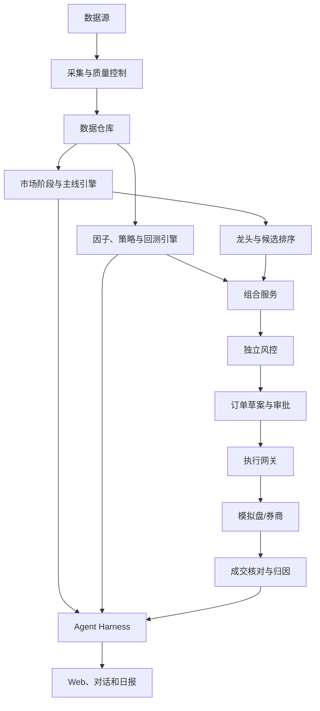

# 量化 Agent 项目说明文档

> 项目代号：Quant Agent  
> 文档状态：Draft v0.1  
> 默认市场：中国内地股票与场内 ETF  
> 默认频率：日频及中低频

## 1. 项目简介

Quant Agent 是一个面向个人投资者或小型研究团队的量化研究与组合决策系统。系统综合行情、行业、财务、公告和账户数据，识别当前市场阶段、主要交易主线及其龙头股票，生成可解释的候选列表、组合建议、回测结果和风险报告。

产品不以“大模型直接预测涨跌”为核心，而是采用：

> 确定性量化引擎 + 独立风控 + Agent 编排与解释 + 人工审批

第一阶段以研究、回测和模拟交易为主；实盘阶段只支持人工确认后的辅助执行。

## 2. 项目背景

传统量化工具通常要求用户掌握数据处理、编程、回测和交易接口。普通行情软件虽然能提供指标和板块排名，但难以：

- 统一判断市场当前处于上涨、震荡、分化还是下跌阶段；
- 区分一日热点与具有持续性的市场主线；
- 在主线中识别趋势龙头、容量龙头和补涨股票；
- 把选股理由、反对证据和失效条件同时展示；
- 将研究、回测、模拟交易、风险控制和复盘连接起来；
- 通过自然语言完成查询、比较和报告生成。

本项目通过 Agent 降低使用门槛，同时通过 Harness 限制模型权限，保证计算与交易环节可审计。

## 3. 用户与使用场景

### 3.1 目标用户

- 希望建立纪律化投资流程的个人投资者；
- 需要自动化日报和候选池的小型投研团队；
- 希望验证 ETF 轮动或股票多因子策略的研究人员；
- 需要模拟盘和交易复盘工具的量化初学者。

### 3.2 核心场景

1. **市场阶段分析**  
   用户询问“当前市场是什么阶段”，系统给出状态、评分、风险预算、支持证据和失效条件。

2. **主线发现**  
   系统根据行业相对强度、上涨覆盖率、成交活跃度、持续性和事件证据识别当前主线。

3. **龙头识别**  
   在已确认主线内，根据相对强度、流动性、趋势质量、带动能力和基本面证据识别龙头。

4. **上涨候选排序**  
   对未来5～20个交易日具有相对上涨潜力的股票进行评分和分层，不做确定性承诺。

5. **ETF 组合管理**  
   根据趋势、动量和波动率生成 ETF 组合建议。

6. **策略回测**  
   用户通过自然语言选择策略、时间区间和基准，系统生成包含交易成本的回测报告。

7. **模拟盘与受控实盘**  
   系统生成订单草案，经风控检查后进入模拟盘，或在人工批准后发送至真实账户。

8. **每日复盘**  
   对信号、订单、成交、收益和风险进行归因，解释预期与实际之间的差异。

## 4. 产品目标

### 4.1 业务目标

- 每个交易日自动生成市场阶段、主线、龙头和候选报告；
- 将从数据更新到报告生成的流程自动化；
- 支持 ETF 策略和主线龙头策略的历史回测；
- 支持模拟盘全流程；
- 建立可审计、可解释、可停止的实盘辅助能力。

### 4.2 成功指标

产品指标：

- 日报按时生成率不低于99%；
- 关键数据完整率不低于99.9%；
- 研究任务成功率不低于98%；
- 所有结论均包含数据截止时间和证据；
- 所有实盘订单均可追溯到人工审批。

研究指标：

- 市场阶段在相邻交易日不过度跳变；
- 主线前 K 名具有可验证的后续相对收益分层；
- 龙头/候选分数与未来超额收益具有单调性；
- 样本外计入成本后仍保持策略稳定性；
- 参数小幅变化不会导致结果断崖式恶化。

安全指标：

- 未审批实盘订单为零；
- 重复实盘订单为零；
- 已知未来数据泄漏为零；
- 风控绕过事件为零。

## 5. 产品边界

### 5.1 第一版包含

- A股与场内 ETF 日线数据；
- 市场阶段识别；
- 行业主线识别；
- 趋势龙头和容量龙头识别；
- 候选股票评分及风险过滤；
- ETF 轮动基准策略；
- 历史回测和滚动验证；
- 每日研究报告；
- 模拟账户；
- 人工审批的实盘辅助接口；
- 审计日志和紧急停止。

### 5.2 第一版不包含

- 高频和超短线自动交易；
- 融资融券、期权、期货和杠杆产品；
- 自动实盘模式；
- 根据聊天内容实时修改生产策略；
- 社交媒体传闻自动触发交易；
- 收费荐股、代客理财或资产管理业务；
- 对收益率或上涨结果作保证。

## 6. 核心产品能力

### 6.1 市场阶段

市场状态划分为：

- 上升趋势；
- 震荡偏强；
- 高位分化；
- 下跌趋势；
- 底部修复。

主要依据：

- 主要指数趋势；
- 市场宽度；
- 新高与新低数量；
- 成交活跃度；
- 行业扩散度；
- 波动率和下行风险；
- 大盘与小盘相对强弱。

系统输出市场环境分和最大风险预算。风险预算表示仓位上限，不代表必须使用的仓位。

### 6.2 主线识别

主线必须具备持续超额收益、板块扩散、成交支持、龙头梯队和可验证逻辑，不能仅凭单日涨幅认定。

主线状态：

- `EMERGING`：正在形成；
- `CONFIRMED`：已经确认；
- `CROWDED`：强势但拥挤；
- `FADING`：正在退潮。

### 6.3 龙头识别

龙头类型：

- 核心龙头；
- 趋势龙头；
- 容量龙头；
- 弹性龙头；
- 补涨龙头；
- 情绪龙头。

第一版只将趋势龙头和容量龙头纳入可交易候选，其他类型仅作观察。

### 6.4 候选股

候选分综合考虑：

- 市场环境；
- 所属主线强度；
- 龙头特征；
- 价格趋势；
- 量价结构；
- 基本面或事件证据；
- 估值；
- 流动性与风险惩罚。

每个候选必须提供：

- 支持证据；
- 反对证据；
- 可交易性；
- 风险等级；
- 观察条件；
- 失效条件；
- 数据截止时间。

### 6.5 ETF 轮动

ETF 模式用于承担主要组合风险，初始策略可综合：

- 20、60、120日动量；
- 波动率调整；
- 中期趋势过滤；
- 1～3只 ETF 配置；
- 无合格标的时降低权益仓位。

### 6.6 Agent 交互

示例问题：

- “今天市场处于什么阶段？”
- “当前前三条主线是什么，分别持续了多久？”
- “某只股票为什么被识别为龙头？”
- “列出支持和反对这只股票的证据。”
- “如果只选择流动性最好的候选，组合如何变化？”
- “用冻结参数回测过去五年，不要重新调参。”
- “今天的调仓建议与昨天相比发生了什么变化？”

Agent 回答必须区分事实、评分、推断和风险。

## 7. 产品工作流

### 7.1 每日收盘后

1. 更新行情、证券状态、行业分类、财务和公告；
2. 执行数据质量检查；
3. 识别市场阶段和风险预算；
4. 计算行业与概念主线；
5. 在主线内识别龙头和候选；
6. 执行可交易性和风险过滤；
7. 更新 ETF 与股票策略信号；
8. 生成日报和第二日观察计划；
9. 更新模拟账户；
10. 保存决策快照和审计记录。

### 7.2 交易日前

1. 检查停复牌、风险公告和公司行动；
2. 检查隔夜价格变化；
3. 重新验证订单草案；
4. 如价格偏离过大则使原草案失效；
5. 由用户决定是否批准实盘订单。

### 7.3 交易后

1. 查询委托与成交；
2. 核对资金和持仓；
3. 记录滑点和费用；
4. 对未成交、拒单和部分成交进行归因；
5. 生成交易复盘。

## 8. 产品形态

### 8.1 Web 控制台

核心页面：

- 市场总览；
- 主线雷达；
- 龙头与候选池；
- 个股证据页；
- ETF 组合；
- 回测中心；
- 模拟/实盘账户；
- 订单审批；
- 风险中心；
- 运行与审计记录。

### 8.2 对话入口

对话用于查询、比较、解释和发起受控任务，不直接替代订单审批界面。

### 8.3 日报

日报包含：

- 市场阶段和变化；
- 主线排名、持续性和拥挤度；
- 龙头及候选变化；
- 组合风险；
- 调仓草案；
- 重要风险事件；
- 数据和策略版本。

## 9. 高层架构

Harness 的详细规则见 [01-agent-harness.md](./01-agent-harness.md)。

## 10. 数据来源与原则

研究阶段可采用：

- Tushare：股票、指数、基金、财务和交易日历；
- AKShare：公开数据补充；
- 交易所和上市公司公告：事实与事件来源；
- 券商接口：实盘行情、账户、订单和成交。

数据原则：

- 保存原始数据；
- 使用按当时可知时点构建的数据；
- 记录公告日期和实际可用日期；
- 复权数据与原始价格分开保存；
- 关键字段跨源校验；
- 第三方接口变化时不静默填充。

## 11. 合规与免责声明

证监会《证券市场程序化交易管理规定（试行）》自2024年10月8日起实施；上交所程序化交易实施细则自2025年7月7日起施行。项目进入实盘前，应向开户券商确认程序化交易报告、接口权限、委托限制和监控要求。

参考：

- [证监会：证券市场程序化交易管理规定（试行）](https://www.csrc.gov.cn/csrc/c100028/c7480577/content.shtml)
- [上交所：程序化交易管理实施细则](https://big5.sse.com.cn/site/cht/www.sse.com.cn/lawandrules/sselawsrules2025/trade/universal/c/c_20250612_10781696.shtml)

本项目是研究与交易辅助工具，不构成具体证券推荐或收益保证。若产品面向他人收费提供荐股、代客交易或资产管理服务，应另行开展法律与资质评估。

## 12. 里程碑

### M1：研究底座

- 日线数据和证券主数据；
- 数据质量检查；
- 市场阶段、行业排名和日报；
- ETF 基准策略。

### M2：主线与龙头

- 主线持续性；
- 龙头分类；
- 候选评分；
- 事件证据与反对证据；
- 历史评测。

### M3：回测与模拟盘

- A股交易规则；
- 滚动验证；
- 模拟账户；
- 订单、成交与核对。

### M4：Agent Harness

- 工具协议；
- 权限与审计；
- 风控和 Kill Switch；
- 对抗评测；
- Web 对话入口。

### M5：辅助实盘

- 券商接口；
- 人工审批；
- 小资金验证；
- 合规确认；
- 不少于3个月模拟盘通过后上线。

## 13. 主要风险

| 风险 | 说明 | 应对 |
|---|---|---|
| 过拟合 | 历史表现无法延续 | 样本外、滚动验证、冻结参数 |
| 未来数据泄漏 | 使用了当时未知的数据 | Point-in-time 数据和回放测试 |
| 主线事后确认 | 只有回头看才显得清晰 | 固定确认规则和决策时点 |
| 龙头不可交易 | 涨停、停牌或流动性不足 | 独立可交易性过滤 |
| 新闻噪声 | 事件误判或提示注入 | 可信源、结构化抽取、外部文本隔离 |
| 模型幻觉 | 编造数字或原因 | 数值工具化、证据引用和拒答机制 |
| 交易故障 | 重复单、部分成交、账户差异 | 幂等、核对和 Kill Switch |
| 合规风险 | 接口或账户不符合要求 | 券商确认、审计和权限限制 |

## 14. 项目决策

当前已确定：

1. 第一版从日频开始；
2. ETF 作为稳健组合，主线龙头作为增强策略；
3. 大模型不负责数值计算；
4. 主线识别必须考虑持续性和扩散度；
5. 龙头候选必须通过可交易性过滤；
6. 实盘默认人工审批；
7. 第一版禁用自动实盘；
8. 所有结论可回放、可解释、可审计。

