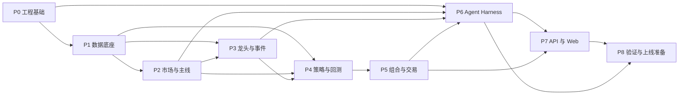

# 量化 Agent 项目进度文档

## P8-T08-E01：每日收盘收益报告与次日草稿名称化

- **状态**：已完成
- **日期**：2026-08-05
- **范围/归属**：P8 模拟盘日终执行器、收盘盯市估值、日报结构、股票名称快照与单元测试。
- **交付物**：
  - 每日 `reports/<trading_date>.json` 新增 `close_report`、`filled_orders` 和 `next_day_order_draft`。
  - 成交、持仓、候选和次日草稿新增股票 `name`，同时保留 `instrument_id` 作为审计键。
  - 日终执行器缓存 Tushare 股票名称快照到 `snapshots/instruments-<trading_date>.json`。
  - 模拟成交后再次按当日收盘价盯市，日报收益反映收盘浮盈浮亏。
  - 新增 `docs/11-p8-daily-profit-report.md`。
- **验收证据**：
  - `pytest -q`：172 passed，覆盖率 90.92%。
  - `ruff check packages/quant_agent/paper_validation/daily.py scripts/paper/run_daily.py tests/unit/test_paper_validation_daily.py`：通过。
  - `mypy packages/quant_agent/paper_validation/daily.py scripts/paper/run_daily.py`：通过。

> 文档状态：执行版 v0.1  
> 初始日期：2026-07-30  
> 当前阶段：P8-T07 历史时点影子运行已完成；P8-T08 模拟盘运行中
> 关联文档：  
> - [Agent Harness 设计文档](./01-agent-harness.md)  
> - [项目说明文档](./02-project-overview.md)  
> - [项目开发文档](./03-development-guide.md)

## 1. 文档用途

本文是项目唯一的任务进度台账，用于：

- 将开发过程划分为互不冲突、边界清晰的任务；
- 标记任务的当前状态、前置依赖和负责模块；
- 明确每个任务的交付物与完成标准；
- 防止未完成、未测试的功能被标记为已完成；
- 支持按阶段统计进度和决定下一项可开始任务；
- 记录阻塞、验收结果和状态变更。

本文只记录任务状态，不替代需求、架构或开发设计文档。

## 2. 状态标签

每个任务只能使用以下一个状态：

| 标签 | 含义 | 使用条件 |
|---|---|---|
| `未开始` | 尚未进入实施 | 没有产生该任务的代码或正式交付物 |
| `开发中未测试` | 正在开发，尚未完成测试 | 已开始实现，但未达到测试条件 |
| `开发完成待测试` | 实现完成，等待测试 | 代码和文档已完成，相关测试尚未全部执行 |
| `测试中` | 正在执行验证 | 已进入单元、集成、回放或验收测试 |
| `阻塞` | 暂时无法继续 | 存在明确外部依赖或决策阻塞，并已记录原因 |
| `返工中` | 测试或审查不通过，正在修改 | 已发现不满足验收标准的问题 |
| `已完成` | 已实现、已测试、已验收 | 所有完成条件满足并留下验证记录 |
| `已取消` | 确认不再实施 | 需要记录取消原因和替代方案 |

不允许使用“基本完成”“差不多完成”“暂时完成”等模糊标签。

## 3. 状态更新规则

### 3.1 标记为“开发中未测试”

必须满足：

- 所有前置任务均为 `已完成`；
- 已确定实现范围；
- 已指定模块或文件归属；
- 没有其他进行中的任务占用同一职责范围；
- 已开始产生实际代码、配置、迁移或测试制品。

### 3.2 标记为“开发完成待测试”

必须满足：

- 任务定义中的交付物全部存在；
- 实现范围内不存在已知未处理的占位逻辑；
- 已完成自查；
- 相关文档和接口契约已经同步。

### 3.3 标记为“测试中”

必须记录：

- 测试环境；
- 测试命令或测试计划；
- 使用的数据版本；
- 已通过和未通过的测试项。

### 3.4 标记为“已完成”

必须同时满足：

- 交付物全部完成；
- 验收条件全部通过；
- 自动化测试通过；
- 需要人工检查的内容已经检查；
- 没有未关闭的高等级缺陷；
- 任务状态更新记录已经填写；
- 后续任务可以依赖其稳定输出。

开发完成但未测试的任务不得标记为 `已完成`。

### 3.5 标记为“阻塞”

必须填写：

- 阻塞原因；
- 阻塞开始时间；
- 解除阻塞所需条件；
- 是否影响关键路径；
- 可并行推进的替代任务。

## 4. 防冲突规则

### 4.1 单一职责

每个任务只负责一个可验收目标。若任务同时涉及数据、策略、交易和页面，应继续拆分。

### 4.2 模块归属

同一时间内，一个底层模块只能由一个进行中的任务负责结构性修改。其他任务只能通过已发布接口使用该模块。

### 4.3 契约先行

涉及多个模块的公共结构必须先由契约任务定义并完成，随后各模块才能并行实现。下游任务不得自行复制或修改公共模型。

### 4.4 数据库迁移唯一

同一阶段内，数据库表结构由指定的数据模型任务统一管理。业务功能任务不能私自新增同名表或重复字段。

### 4.5 配置归属

- 环境配置由工程基础任务管理；
- 策略参数由策略任务管理；
- 风控阈值由风控任务管理；
- Agent 提示词和工具权限由 Harness 任务管理。

不同任务不得在自己的模块中硬编码其他模块的配置。

### 4.6 测试不修改生产逻辑

测试任务只新增测试、夹具和缺陷记录。若需修改生产逻辑，应把对应实现任务改为 `返工中`，由该任务范围完成修复。

### 4.7 明确依赖

任务只有在所有前置依赖均为 `已完成` 后才能开始。不存在依赖关系且模块归属不同的任务可以并行。

## 5. 任务字段说明

每个任务包含：

| 字段 | 说明 |
|---|---|
| 任务编号 | 全局唯一，完成后不复用 |
| 状态 | 使用本文定义的状态标签 |
| 目标 | 该任务唯一要解决的问题 |
| 范围/归属 | 允许修改的模块或职责 |
| 前置任务 | 必须先完成的任务 |
| 交付物 | 应产生的代码、配置、文档或报告 |
| 验收标准 | 标记为已完成前必须满足的条件 |

## 6. 总体进度

| 阶段 | 名称 | 任务数 | 已完成 | 当前状态 |
|---|---|---:|---:|---|
| P0 | 工程与治理基础 | 7 | 7 | 已完成 |
| P1 | 数据底座 | 9 | 9 | 已完成 |
| P2 | 市场阶段与主线 | 8 | 8 | 已完成 |
| P3 | 龙头、候选与事件证据 | 8 | 8 | 已完成 |
| P4 | 策略与回测 | 8 | 8 | 已完成 |
| P5 | 组合、风控与模拟交易 | 8 | 8 | 已完成 |
| P6 | Agent Harness | 9 | 9 | 已完成 |
| P7 | API、Web 与报告 | 8 | 8 | 已完成 |
| P8 | 系统验证、部署与实盘准备 | 10 | 7 | P8-T07 已完成，P8-T08 运行中 |
| **合计** |  | **75** | **72** | **P8 进行中** |

总体完成度：`72 / 75 = 96.0%`

## 7. 阶段依赖



## 8. P0：工程与治理基础

### P0-T01：初始化项目仓库

- **状态**：`已完成`
- **目标**：建立标准项目目录、基础说明和忽略规则。
- **范围/归属**：仓库根目录、`apps/`、`packages/`、`tests/`、`configs/`。
- **前置任务**：无。
- **交付物**：
  - 标准目录结构；
  - 根目录 README；
  - Git 忽略规则；
  - 模块职责说明。
- **验收标准**：
  - 目录与开发文档一致；
  - 研究、执行、Web 和测试目录相互隔离；
  - 不包含密钥、真实账户或大体积数据；
  - 新开发者能根据 README 找到启动入口。

### P0-T02：建立 Python 工程与依赖管理

- **状态**：`已完成`
- **目标**：建立可重复安装的 Python 开发环境。
- **范围/归属**：Python 项目配置、依赖锁文件、基础包初始化。
- **前置任务**：P0-T01。
- **交付物**：
  - Python 版本约束；
  - 生产、开发和测试依赖分组；
  - 依赖锁文件；
  - 最小可导入包。
- **验收标准**：
  - 全新环境可一次完成安装；
  - 依赖版本可复现；
  - 不依赖开发者本机隐式包；
  - 最小导入检查通过。

### P0-T03：建立代码质量与测试框架

- **状态**：`已完成`
- **目标**：统一格式、静态检查、类型检查和测试入口。
- **范围/归属**：代码质量工具配置、`tests/` 公共配置。
- **前置任务**：P0-T02。
- **交付物**：
  - 格式化配置；
  - 静态检查配置；
  - 类型检查配置；
  - pytest 配置；
  - 示例测试。
- **验收标准**：
  - 格式、静态检查、类型检查和测试命令可独立运行；
  - 示例错误能被对应检查发现；
  - 示例测试通过；
  - 检查规则写入开发说明。

### P0-T04：定义公共领域契约

- **状态**：`已完成`
- **目标**：定义跨模块共用的标识、时间、金额、响应和错误模型。
- **范围/归属**：`packages/core`、`data_contracts`。
- **前置任务**：P0-T02。
- **交付物**：
  - 请求 ID、决策 ID 和版本标识；
  - 带时区时间类型；
  - 金额和数量类型；
  - 通用工具响应；
  - 统一错误码。
- **验收标准**：
  - 所有时间拒绝无时区值；
  - 金额计算不存在明显浮点误差；
  - 错误与正常空结果可区分；
  - 契约通过序列化往返测试。

### P0-T05：建立配置与密钥规范

- **状态**：`已完成`
- **目标**：建立环境配置、版本化业务配置和密钥引用机制。
- **范围/归属**：`configs/environments`、配置加载模块。
- **前置任务**：P0-T02、P0-T04。
- **交付物**：
  - `local/test/replay/paper/production` 环境配置；
  - 配置校验器；
  - 示例环境变量；
  - 密钥引用规范。
- **验收标准**：
  - 本地默认运行模式为 `RESEARCH`；
  - 第一版无法通过普通配置启用 `LIVE_AUTO`；
  - 缺失关键配置时启动失败；
  - 仓库内不包含真实密钥。

### P0-T06：建立日志、追踪和审计基础

- **状态**：`已完成`
- **目标**：为后续服务提供结构化日志、追踪 ID 和审计写入接口。
- **范围/归属**：`packages/observability`。
- **前置任务**：P0-T04、P0-T05。
- **交付物**：
  - 结构化日志；
  - 请求链路 ID；
  - 审计事件接口；
  - 敏感字段脱敏器。
- **验收标准**：
  - 同一请求跨模块保持同一追踪 ID；
  - 密钥和完整令牌不会写入日志；
  - 审计事件包含操作者、时间、动作和结果；
  - 日志失败不会静默改变业务结果。

### P0-T07：建立持续集成

- **状态**：`已完成`
- **目标**：在代码合并前自动执行质量检查。
- **范围/归属**：CI 配置。
- **前置任务**：P0-T03、P0-T06。
- **交付物**：
  - 安装、格式、静态检查、类型检查和测试流水线；
  - 测试报告；
  - 失败阻断规则。
- **验收标准**：
  - 正常提交通过；
  - 注入格式、类型和测试错误时流水线失败；
  - 失败步骤清晰可定位；
  - CI 不使用真实券商或生产数据。

## 9. P1：数据底座

### P1-T01：设计数据分层与数据库模型

- **状态**：`已完成`
- **目标**：定义 RAW、STAGED、CURATED、FEATURE 和 SNAPSHOT 数据结构。
- **范围/归属**：`packages/data/models`、`migrations`。
- **前置任务**：P0-T04、P0-T05。
- **交付物**：
  - 核心表结构；
  - 主键和唯一约束；
  - `event_time/available_at/ingested_at/version/source` 字段规范；
  - 初始数据库迁移。
- **验收标准**：
  - 支持时点查询；
  - 相同来源重复数据不能产生重复记录；
  - 行业归属和指数成分支持历史生效区间；
  - 迁移可在空数据库执行。

### P1-T02：实现交易日历与证券主数据

- **状态**：`已完成`
- **目标**：提供统一交易日、证券标识和生效状态。
- **范围/归属**：`packages/data/master`。
- **前置任务**：P1-T01。
- **交付物**：
  - 交易日历服务；
  - 股票、ETF、指数主数据；
  - 代码映射与生效区间；
  - 证券状态查询。
- **验收标准**：
  - 能判断给定日期是否交易日；
  - 证券代码按日期解析；
  - 已退市或尚未上市证券不会进入错误时点；
  - 单元测试覆盖代码变更和边界日期。

### P1-T03：定义数据源适配器契约

- **状态**：`已完成`
- **目标**：隔离第三方数据源字段和调用方式。
- **范围/归属**：`packages/data/providers/base`。
- **前置任务**：P0-T04、P1-T01。
- **交付物**：
  - 行情、证券状态、财务、基金和公告 Provider 协议；
  - 标准异常类型；
  - 请求限频与重试约定；
  - 伪数据 Provider。
- **验收标准**：
  - 领域层不依赖第三方字段名；
  - 测试可完全使用伪数据；
  - 超时、限频和数据为空可区分；
  - Provider 输出满足公共契约。

### P1-T04：实现首个日线行情数据源

- **状态**：`已完成`
- **目标**：采集股票、ETF 和指数的未复权日线行情。
- **范围/归属**：首个行情 Provider、RAW/STAGED 写入。
- **前置任务**：P1-T02、P1-T03。
- **交付物**：
  - 日线采集器；
  - 增量更新；
  - 原始响应归档；
  - 标准行情映射。
- **验收标准**：
  - 指定交易日可重复采集且不重复写入；
  - OHLC、成交量和成交额字段完整；
  - 数据源失败不会写入伪正常数据；
  - 使用伪数据和小规模真实样本验证通过。

### P1-T05：实现复权与公司行动数据

- **状态**：`已完成`
- **目标**：分开保存原始价格、复权因子和公司行动。
- **范围/归属**：`packages/data/corporate_actions`。
- **前置任务**：P1-T04。
- **交付物**：
  - 复权因子采集；
  - 分红、拆并股等公司行动模型；
  - 前复权/后复权研究视图；
  - 连续性检查。
- **验收标准**：
  - 原始价格不被覆盖；
  - 给定日期可重建当时可用复权序列；
  - 除权日测试样本计算正确；
  - 异常跳变进入质量告警。

### P1-T06：实现 Point-in-time 财务数据

- **状态**：`已完成`
- **目标**：保存财务指标的报告期、公告时间和可用时间。
- **范围/归属**：`packages/data/fundamentals`。
- **前置任务**：P1-T03、P1-T01。
- **交付物**：
  - 财务数据采集；
  - 更正/修订版本；
  - 按决策时点查询接口；
  - 未来数据泄漏测试。
- **验收标准**：
  - `available_at > decision_time` 的记录无法被查询；
  - 修订数据不会覆盖原始历史版本；
  - 多期财务数据可按公告顺序重放；
  - 时点泄漏测试通过。

### P1-T07：实现行业分类与历史归属

- **状态**：`已完成`
- **目标**：提供稳定的行业分类和历史成员关系。
- **范围/归属**：`packages/data/classification`。
- **前置任务**：P1-T02、P1-T03。
- **交付物**：
  - 行业层级；
  - 股票行业归属区间；
  - 行业成分时点查询；
  - 分类版本记录。
- **验收标准**：
  - 股票调入调出按生效日期生效；
  - 历史查询不使用当前行业归属回填；
  - 行业成员无重叠冲突；
  - 至少一组历史变更测试通过。

### P1-T08：建立数据质量引擎

- **状态**：`已完成`
- **目标**：统一执行完整性、合法性、连续性和跨源检查。
- **范围/归属**：`packages/data/quality`。
- **前置任务**：P1-T04、P1-T05、P1-T06、P1-T07。
- **交付物**：
  - 质量规则注册器；
  - 质量结果表；
  - 严重等级；
  - 失败关闭机制。
- **验收标准**：
  - 能发现缺失交易日、非法 OHLC、重复记录和异常复权；
  - 关键错误阻止生成可交易快照；
  - 警告和错误可追溯到数据版本；
  - 每条规则具有正反测试样例。

### P1-T09：实现冻结数据快照

- **状态**：`已完成`
- **目标**：为回测和每日决策生成不可变数据版本。
- **范围/归属**：`packages/data/snapshots`。
- **前置任务**：P1-T08。
- **交付物**：
  - 快照生成器；
  - 数据版本清单；
  - 内容哈希；
  - 快照查询 API。
- **验收标准**：
  - 质量检查未通过时不能生成合格快照；
  - 同一输入生成相同内容哈希；
  - 已发布快照不可原地修改；
  - 能重建任意已保存快照的输入清单。

## 10. P2：市场阶段与主线

### P2-T01：实现通用滚动特征框架

- **状态**：`已完成`
- **目标**：统一滚动窗口、最少观测数、缺失值和版本管理。
- **范围/归属**：`packages/features/core`。
- **前置任务**：P1-T09。
- **交付物**：
  - 滚动特征接口；
  - 特征元数据；
  - 缓存键规则；
  - 防未来数据测试。
- **验收标准**：
  - 所有特征显式接收 `as_of`；
  - 窗口不足时行为一致；
  - 相同快照和参数结果可复现；
  - 未来记录不会影响较早特征。

### P2-T02：实现市场趋势特征

- **状态**：`已完成`
- **目标**：计算主要指数趋势、均线位置和斜率。
- **范围/归属**：`packages/features/market_trend`。
- **前置任务**：P2-T01。
- **交付物**：
  - 20/60/120日趋势；
  - 均线位置与斜率；
  - 多指数聚合；
  - 标准化分数。
- **验收标准**：
  - 边界窗口测试通过；
  - 指数缺失时明确失败或降级；
  - 结果绑定数据和特征版本；
  - 人工样本计算一致。

### P2-T03：实现市场宽度与风险特征

- **状态**：`已完成`
- **目标**：计算上涨覆盖、新高新低、成交和波动特征。
- **范围/归属**：`packages/features/market_breadth`。
- **前置任务**：P2-T01、P1-T02。
- **交付物**：
  - 上涨/下跌家数；
  - 均线以上比例；
  - 新高/新低比例；
  - 成交额分位数；
  - 下行波动率。
- **验收标准**：
  - 股票池按历史可交易状态过滤；
  - 停牌处理规则明确；
  - 分母和缺失值处理有测试；
  - 指标与固定样本人工核对一致。

### P2-T04：实现市场阶段分类器

- **状态**：`已完成`
- **目标**：输出五类市场阶段、环境分和风险预算上限。
- **范围/归属**：`packages/regime`。
- **前置任务**：P2-T02、P2-T03。
- **交付物**：
  - 基准评分模型；
  - 状态映射；
  - 支持/反对证据；
  - 置信度定义。
- **验收标准**：
  - 输出符合 Harness 契约；
  - 置信度不被描述为上涨概率；
  - 每个状态均有测试场景；
  - 结果包含失效条件。

### P2-T05：实现市场状态防抖与切换

- **状态**：`已完成`
- **目标**：防止市场状态因单日噪声频繁切换。
- **范围/归属**：`packages/regime/transitions`。
- **前置任务**：P2-T04。
- **交付物**：
  - 进入/退出阈值；
  - 确认天数；
  - 状态转换记录；
  - 原始与最终状态对照。
- **验收标准**：
  - 防抖只使用当前及过去数据；
  - 固定序列的转换符合预期；
  - 状态变化具有明确证据；
  - 配置变更可版本化。

### P2-T06：实现行业相对强度与扩散特征

- **状态**：`已完成`
- **目标**：计算行业5/20/60日相对收益和板块扩散。
- **范围/归属**：`packages/features/themes`。
- **前置任务**：P2-T01、P1-T07。
- **交付物**：
  - 行业相对强度；
  - 上涨覆盖率；
  - 成交额增量；
  - 新高占比；
  - 下跌日抗跌性。
- **验收标准**：
  - 使用历史行业归属；
  - 单只股票贡献可识别；
  - 行业成员不足时不产生误导分数；
  - 固定样本排名可复现。

### P2-T07：实现主线评分与状态

- **状态**：`已完成`
- **目标**：识别形成、确认、拥挤和退潮主线。
- **范围/归属**：`packages/themes/scoring`。
- **前置任务**：P2-T05、P2-T06。
- **交付物**：
  - 主线评分；
  - 最近排名与持续天数；
  - 状态机；
  - 拥挤度和反向证据。
- **验收标准**：
  - 单日大涨不能直接成为确认主线；
  - 确认规则满足“最近5日至少3日进入前5”等配置；
  - 结果包含支持和反对证据；
  - 状态转换通过固定序列测试。

### P2-T08：建立市场与主线历史评测

- **状态**：`已完成`
- **目标**：验证市场状态稳定性和主线后续相对收益。
- **范围/归属**：`tests/replay/regime_themes`、研究报告。
- **前置任务**：P2-T07。
- **交付物**：
  - 历史回放数据集；
  - 状态持续时间统计；
  - 主线 Precision@K；
  - 未来5/10/20日行业相对收益。
- **验收标准**：
  - 使用冻结快照；
  - 不随机打乱时间序列；
  - 指标计算可复现；
  - 报告同时展示有效与失效时期。

## 11. P3：龙头、候选与事件证据

### P3-T01：实现公告与事件证据模型

- **状态**：`已完成`
- **目标**：将公告和可信事件转换为带来源的结构化证据。
- **范围/归属**：`packages/data/events`。
- **前置任务**：P1-T03、P1-T09。
- **交付物**：
  - 公告采集；
  - 事件类型；
  - 实体映射；
  - 来源、发布时间和内容哈希。
- **验收标准**：
  - 事件保留原始来源；
  - 发布时间晚于决策时点的事件不可使用；
  - 同一事件不会重复计分；
  - 无法解析时保留原文但不生成确定性结论。

### P3-T02：实现外部文本安全清洗

- **状态**：`已完成`
- **目标**：隔离新闻和公告中的提示注入及非事实指令。
- **范围/归属**：`packages/agent/content_security`。
- **前置任务**：P3-T01、P0-T06。
- **交付物**：
  - 不可信内容标记；
  - 指令性文本过滤；
  - 长度与格式限制；
  - 对抗样例。
- **验收标准**：
  - 外部文本不能改变工具权限；
  - 包含“忽略系统规则”的样例不会触发执行；
  - 清洗过程可审计；
  - 原始内容与结构化结果可追溯。

### P3-T03：实现个股趋势与相对强度特征

- **状态**：`已完成`
- **目标**：计算个股趋势质量及相对行业、基准的强弱。
- **范围/归属**：`packages/features/stocks`。
- **前置任务**：P2-T01、P1-T07。
- **交付物**：
  - 相对强度；
  - 均线斜率；
  - 突破保持；
  - 回调幅度；
  - 新高距离。
- **验收标准**：
  - 全部特征只使用当前及过去数据；
  - 停牌期间处理规则明确；
  - 行业缺失时行为明确；
  - 固定样本人工核对一致。

### P3-T04：实现流动性与可交易性特征

- **状态**：`已完成`
- **目标**：判断候选是否可被实际交易。
- **范围/归属**：`packages/features/tradeability`。
- **前置任务**：P1-T02、P1-T04。
- **交付物**：
  - 成交额和换手率分位数；
  - 停牌、涨跌停状态；
  - 上市天数；
  - 资金容量估计。
- **验收标准**：
  - 不可交易原因结构化输出；
  - 阈值可配置且版本化；
  - 不同资金规模产生合理容量结果；
  - 边界状态测试通过。

### P3-T05：实现基本面质量与风险特征

- **状态**：`已完成`
- **目标**：为趋势候选提供基本面支持和风险惩罚。
- **范围/归属**：`packages/features/fundamentals`。
- **前置任务**：P1-T06、P2-T01。
- **交付物**：
  - 盈利、现金流、杠杆和稳定性特征；
  - 财务异常标记；
  - 缺失处理；
  - 时点安全测试。
- **验收标准**：
  - 使用当时已公告数据；
  - 修订数据不会穿越回填；
  - 缺失不被自动解释为中性；
  - 每个风险特征可追溯到财务记录。

### P3-T06：实现龙头评分与分类

- **状态**：`已完成`
- **目标**：在已确认主线中识别龙头并进行类型分类。
- **范围/归属**：`packages/leaders`。
- **前置任务**：P2-T07、P3-T03、P3-T04、P3-T05。
- **交付物**：
  - 龙头评分；
  - 趋势、容量、弹性等分类；
  - 板块带动能力；
  - 风险惩罚。
- **验收标准**：
  - 只在主线成分内排名；
  - 单纯涨幅最高不自动成为核心龙头；
  - 第一版可交易候选只包含趋势和容量龙头；
  - 输出符合 Harness 契约。

### P3-T07：实现候选股评分与过滤

- **状态**：`已完成`
- **目标**：综合市场、主线、龙头、量价和风险生成候选池。
- **范围/归属**：`packages/leaders/candidates`。
- **前置任务**：P2-T05、P3-T06。
- **交付物**：
  - 候选评分；
  - A/B/观察分层；
  - 可交易性过滤；
  - 支持、反对及失效条件。
- **验收标准**：
  - 未校准前只显示分数和排名；
  - 排除股票保留排除原因；
  - 不使用“确定上涨”等表述；
  - 相同快照和版本结果一致。

### P3-T08：建立龙头与候选历史评测

- **状态**：`已完成`
- **目标**：验证评分与未来超额收益的关系。
- **范围/归属**：`tests/replay/leaders_candidates`、评测报告。
- **前置任务**：P3-T07。
- **交付物**：
  - 5/10/20日标签；
  - 分层收益；
  - Precision@K；
  - 最大不利波动；
  - 不可成交比例。
- **验收标准**：
  - 使用严格时点数据；
  - 结果按年份和市场阶段拆分；
  - 同时报告交易成本前后结果；
  - 不以单一时期表现判定有效。

## 12. P4：策略与回测

### P4-T01：定义回测事件和交易规则契约

- **状态**：`已完成`
- **目标**：统一信号、订单、成交、费用和持仓事件。
- **范围/归属**：`packages/backtest/contracts`。
- **前置任务**：P0-T04、P1-T02。
- **交付物**：
  - 回测事件模型；
  - 订单和成交模型；
  - 市场规则接口；
  - 费用规则版本接口。
- **验收标准**：
  - 支持股票与 ETF 的差异规则；
  - 费用按生效日期版本化；
  - 事件可序列化和重放；
  - 契约不依赖具体策略。

### P4-T02：实现向量化研究引擎

- **状态**：`已完成`
- **目标**：支持因子分层和快速策略研究。
- **范围/归属**：`packages/backtest/vectorized`。
- **前置任务**：P4-T01、P1-T09。
- **交付物**：
  - 信号对齐；
  - 分层组合；
  - 基准比较；
  - 研究指标。
- **验收标准**：
  - 信号至少滞后一交易时点执行；
  - 可检测常见对齐泄漏；
  - 相同输入输出一致；
  - 与人工小样本结果一致。

### P4-T03：实现事件驱动回测核心

- **状态**：`已完成`
- **目标**：准确模拟订单、成交、资金和持仓。
- **范围/归属**：`packages/backtest/event_driven`。
- **前置任务**：P4-T01。
- **交付物**：
  - 时钟；
  - 订单撮合；
  - 资金与持仓；
  - 结果快照。
- **验收标准**：
  - 不允许使用未来价格成交；
  - 现金和持仓守恒；
  - 订单状态转换合法；
  - 固定场景可完整重放。

### P4-T04：实现 A 股交易限制与成本

- **状态**：`已完成`
- **目标**：模拟适用的交易单位、停牌、涨跌停和费用。
- **范围/归属**：`packages/backtest/cn_market_rules`。
- **前置任务**：P4-T03、P3-T04。
- **交付物**：
  - 最小交易单位；
  - 停牌与不可成交；
  - 涨跌停约束；
  - 手续费、税费和滑点；
  - 部分成交规则。
- **验收标准**：
  - 各规则有生效日期；
  - 不可成交订单不会被错误成交；
  - 最低费用正确；
  - 边界价格和数量测试通过。

### P4-T05：实现 ETF 轮动基准策略

- **状态**：`已完成`
- **目标**：建立可作为系统基准的 ETF 中低频策略。
- **范围/归属**：`packages/strategies/etf_rotation`、ETF 配置。
- **前置任务**：P2-T05、P4-T02、P4-T04。
- **交付物**：
  - ETF 标的池；
  - 动量与波动调整；
  - 趋势过滤；
  - 调仓规则。
- **验收标准**：
  - 标的池按历史状态构建；
  - 参数版本化；
  - 无合格标的时按规则降仓；
  - 向量化和事件回测信号一致。

### P4-T06：实现主线龙头增强策略

- **状态**：`已完成`
- **目标**：将确认主线和可交易龙头转换为规则化组合信号。
- **范围/归属**：`packages/strategies/mainline_leader`。
- **前置任务**：P3-T07、P4-T04。
- **交付物**：
  - 进入条件；
  - 等权或风险权重；
  - 主线退潮退出；
  - 个股失效退出；
  - 换手约束。
- **验收标准**：
  - 不追踪不可交易情绪龙头；
  - 入场和退出均可重放；
  - 不由 Agent 临时修改参数；
  - 策略输出只包含目标组合，不直接下单。

### P4-T07：实现滚动验证与参数冻结

- **状态**：`已完成`
- **目标**：建立训练、验证、样本外和滚动前推流程。
- **范围/归属**：`packages/backtest/validation`。
- **前置任务**：P4-T05、P4-T06。
- **交付物**：
  - 时间序列切分；
  - 参数注册；
  - 参数冻结；
  - 样本外报告。
- **验收标准**：
  - 时间序列不得随机打乱；
  - 样本外期间不重新选择最优参数；
  - 报告记录每个参数版本；
  - 参数扰动稳定性可计算。

### P4-T08：建立策略回测验收报告

- **状态**：`已完成`
- **目标**：形成统一、不过度强调单一收益指标的策略报告。
- **范围/归属**：`packages/reports/backtest`。
- **前置任务**：P4-T07。
- **交付物**：
  - 收益与基准；
  - 回撤与风险；
  - 换手和成本；
  - 市场阶段分组；
  - 参数敏感性；
  - 失败时期。
- **验收标准**：
  - 报告绑定数据、代码、策略和参数版本；
  - 成本前后结果同时展示；
  - 图表和表格结果一致；
  - 结果可由同一快照重复生成。

## 13. P5：组合、风控与模拟交易

### P5-T01：实现账户和组合快照

- **状态**：`已完成`
- **目标**：统一表示资金、持仓、冻结数量和估值。
- **范围/归属**：`packages/portfolio/snapshots`。
- **前置任务**：P0-T04、P4-T01。
- **交付物**：
  - 账户快照；
  - 持仓快照；
  - 估值时点；
  - 快照内容哈希。
- **验收标准**：
  - 资金和持仓具有明确时点；
  - 已冻结和可用数量分开；
  - 快照不可原地修改；
  - 序列化往返测试通过。

### P5-T02：实现目标组合构建

- **状态**：`已完成`
- **目标**：将策略信号转换为目标权重和组合差异。
- **范围/归属**：`packages/portfolio/builder`。
- **前置任务**：P4-T05、P4-T06、P5-T01。
- **交付物**：
  - 当前/目标权重；
  - ETF 与股票资金预算；
  - 行业和个股约束；
  - 预计换手。
- **验收标准**：
  - 权重之和不超过允许上限；
  - 结果可解释到每个策略信号；
  - 策略资金相互隔离后再聚合；
  - 不生成具体券商订单。

### P5-T03：定义独立风控规则契约

- **状态**：`已完成`
- **目标**：建立与 Agent 和策略解耦的风控接口。
- **范围/归属**：`packages/risk/contracts`、`configs/risk`。
- **前置任务**：P0-T04、P5-T01。
- **交付物**：
  - 风控请求；
  - 违规、警告和通过结果；
  - 规则严重等级；
  - 风控版本。
- **验收标准**：
  - 硬违规与警告明确区分；
  - 风控服务失败默认为拒绝；
  - 规则输入不依赖自然语言；
  - 契约测试通过。

### P5-T04：实现组合风控

- **状态**：`已完成`
- **目标**：检查总仓位、个股、ETF、行业、换手和回撤限制。
- **范围/归属**：`packages/risk/portfolio`。
- **前置任务**：P5-T02、P5-T03。
- **交付物**：
  - 集中度规则；
  - 风险预算；
  - 换手限制；
  - 回撤预警和停止新增风险规则。
- **验收标准**：
  - 收紧阈值不会增加允许风险；
  - 每条规则有允许和拒绝测试；
  - 违规结果定位到标的和规则；
  - 风控阈值版本化。

### P5-T05：实现订单草案生成

- **状态**：`已完成`
- **目标**：将通过风控的组合差异转换为不可执行的订单草案。
- **范围/归属**：`packages/execution/order_drafts`。
- **前置任务**：P4-T04、P5-T04。
- **交付物**：
  - 数量取整；
  - 买卖方向；
  - 参考价格；
  - 费用和滑点估计；
  - 订单批次哈希。
- **验收标准**：
  - 硬违规时不能创建草案；
  - 可用资金和可卖数量校验正确；
  - 草案不包含执行权限；
  - 同一输入草案内容一致。

### P5-T06：实现模拟账户和模拟撮合

- **状态**：`已完成`
- **目标**：支持真实数据驱动的模拟订单、成交和持仓。
- **范围/归属**：`packages/execution/paper`。
- **前置任务**：P5-T05。
- **交付物**：
  - 模拟账户；
  - 模拟委托；
  - 模拟成交；
  - 费用和资金变更。
- **验收标准**：
  - 模拟盘不访问真实券商凭证；
  - 现金和持仓守恒；
  - 无法成交状态正确保留；
  - 重复请求不会重复成交。

### P5-T07：实现成交与持仓核对

- **状态**：`已完成`
- **目标**：核对计划、委托、成交、资金和实际持仓。
- **范围/归属**：`packages/reconciliation`。
- **前置任务**：P5-T06。
- **交付物**：
  - 订单核对；
  - 成交核对；
  - 资金与持仓差异；
  - 差异严重等级。
- **验收标准**：
  - 正常、拒单、部分成交和重复回报场景通过；
  - 差异不被自动忽略；
  - 核对结果关联决策和订单；
  - 严重差异能触发停止信号。

### P5-T08：实现 Kill Switch 核心

- **状态**：`已完成`
- **目标**：统一停止新增订单并保存事故现场。
- **范围/归属**：`packages/risk/kill_switch`。
- **前置任务**：P5-T03、P5-T07、P0-T06。
- **交付物**：
  - 全局和账户级开关；
  - 触发原因；
  - 恢复审批；
  - 审计事件。
- **验收标准**：
  - 开关启用后新增订单全部拒绝；
  - 账实严重不一致可自动触发；
  - Agent 无权关闭；
  - 触发和恢复全过程可审计。

## 14. P6：Agent Harness

### P6-T01：实现决策快照

- **状态**：`已完成`
- **目标**：锁定一次 Agent 决策的数据、策略、参数、风险和账户版本。
- **范围/归属**：`packages/agent/snapshots`。
- **前置任务**：P1-T09、P5-T01、P0-T04。
- **交付物**：
  - `DecisionSnapshot`；
  - 决策 ID；
  - 版本引用；
  - 不可变存储。
- **验收标准**：
  - 决策开始后不能静默替换数据；
  - 更新数据必须创建新决策；
  - 快照包含 Harness 要求的全部字段；
  - 内容哈希可验证。

### P6-T02：实现工具注册与权限模型

- **状态**：`已完成`
- **目标**：只允许 Agent 调用已注册且符合当前模式的工具。
- **范围/归属**：`packages/agent/tools`。
- **前置任务**：P0-T04、P0-T05。
- **交付物**：
  - 工具注册器；
  - 工具分类；
  - 模式权限矩阵；
  - 参数校验。
- **验收标准**：
  - 未注册工具无法调用；
  - 研究模式不能创建或提交订单；
  - `approve_order_batch` 不注册为 Agent 工具；
  - 权限拒绝进入审计日志。

### P6-T03：封装研究分析工具

- **状态**：`已完成`
- **目标**：将数据校验、市场、主线、龙头和候选引擎暴露为只读工具。
- **范围/归属**：`packages/agent/tools/research`。
- **前置任务**：P2-T07、P3-T07、P6-T01、P6-T02。
- **交付物**：
  - 市场快照工具；
  - 数据校验工具；
  - 市场阶段工具；
  - 主线、龙头和候选工具。
- **验收标准**：
  - 所有工具返回标准响应；
  - 输出带 `decision_id/as_of/version`；
  - 错误不能转换为空结果；
  - 数值与底层引擎一致。

### P6-T04：封装组合、风控和模拟交易工具

- **状态**：`已完成`
- **目标**：以受控工具连接组合、风控、订单草案和模拟盘。
- **范围/归属**：`packages/agent/tools/portfolio_execution`。
- **前置任务**：P5-T08、P6-T01、P6-T02。
- **交付物**：
  - 组合快照；
  - 目标组合；
  - 风控检查；
  - 订单草案；
  - 模拟提交和核对。
- **验收标准**：
  - 工具调用顺序受状态约束；
  - 风控失败不能创建订单草案；
  - 模拟与实盘工具权限隔离；
  - 所有写操作要求幂等键。

### P6-T05：实现显式 Agent 状态机

- **状态**：`已完成`
- **目标**：按照 Harness 主流程控制任务，避免模型自由循环。
- **范围/归属**：`packages/agent/runtime`。
- **前置任务**：P6-T03、P6-T04。
- **交付物**：
  - 状态枚举；
  - 转换规则；
  - 最大调用次数；
  - 超时和取消。
- **验收标准**：
  - 非法状态转换被拒绝；
  - 风控、审批和核对阶段不能跳过；
  - 超时任务进入明确终态；
  - 状态轨迹可完整回放。

### P6-T06：实现 Agent 输出契约与证据引用

- **状态**：`已完成`
- **目标**：强制区分事实、推断、反对证据和风险。
- **范围/归属**：`packages/agent/responses`。
- **前置任务**：P6-T03、P6-T05。
- **交付物**：
  - `AgentAnswer`；
  - 证据引用；
  - 失效条件；
  - 禁止表述检查。
- **验收标准**：
  - 所有市场结论包含数据截止时间；
  - 没有证据时返回证据不足；
  - 不出现“稳赚”“确定上涨”等禁止表述；
  - 数字可追溯到工具响应。

### P6-T07：实现提示注入与敏感信息防护

- **状态**：`已完成`
- **目标**：防止外部内容或用户指令提升 Agent 权限。
- **范围/归属**：`packages/agent/security`。
- **前置任务**：P3-T02、P6-T02、P6-T05。
- **交付物**：
  - 不可信内容隔离；
  - 敏感输出过滤；
  - 工具参数约束；
  - 对抗用例。
- **验收标准**：
  - 外部文本不能调用执行工具；
  - 用户不能通过对话切换运行模式；
  - 密钥、令牌和完整账户信息不输出；
  - 对抗测试通过。

### P6-T08：建立 Agent 轨迹评测

- **状态**：`已完成`
- **目标**：自动验证工具选择、调用顺序、事实性和风控遵守。
- **范围/归属**：`tests/adversarial`、`tests/replay/agent`。
- **前置任务**：P6-T06、P6-T07。
- **交付物**：
  - 黄金任务；
  - 轨迹断言；
  - 事实和证据指标；
  - 风控绕过测试。
- **验收标准**：
  - 至少覆盖 Harness 定义的12个黄金场景；
  - 应拒绝任务全部被拒绝；
  - 无未来数据和无证据数字；
  - 结果报告可重复生成。

### P6-T09：实现 Harness 审计与回放

- **状态**：`已完成`
- **目标**：从审计记录重建一次完整 Agent 决策。
- **范围/归属**：`packages/agent/audit_replay`。
- **前置任务**：P0-T06、P6-T08。
- **交付物**：
  - 工具参数和响应哈希；
  - 状态轨迹；
  - 决策回放；
  - 差异报告。
- **验收标准**：
  - 可从 `decision_id` 找到全部关联记录；
  - 重放使用原数据和配置版本；
  - 关键审计字段缺失时明确失败；
  - 敏感字段保持脱敏。

## 15. P7：API、Web 与报告

### P7-T01：实现 API 基础与认证

- **状态**：`已完成`
- **目标**：建立版本化 API、认证、请求 ID 和统一错误。
- **范围/归属**：`apps/api/core`。
- **前置任务**：P0-T04、P0-T06。
- **交付物**：
  - FastAPI 应用；
  - `/v1` 路由；
  - 身份认证；
  - 角色模型；
  - 统一错误响应。
- **验收标准**：
  - 未认证访问被拒绝；
  - 请求 ID 贯穿日志；
  - 权限测试覆盖主要角色；
  - API 文档可生成。

### P7-T02：实现市场、主线和候选 API

- **状态**：`已完成`
- **目标**：向 Web 和 Agent 提供只读研究结果。
- **范围/归属**：`apps/api/routes/research`。
- **前置任务**：P7-T01、P2-T07、P3-T07。
- **交付物**：
  - 市场阶段接口；
  - 主线列表；
  - 龙头列表；
  - 候选列表；
  - 个股证据。
- **验收标准**：
  - 查询结果包含 `as_of` 和版本；
  - 分页和筛选稳定；
  - 无数据与服务错误可区分；
  - 契约测试通过。

### P7-T03：实现回测和组合 API

- **状态**：`已完成`
- **目标**：支持受控创建回测、查看结果和生成组合提案。
- **范围/归属**：`apps/api/routes/backtest_portfolio`。
- **前置任务**：P7-T01、P4-T08、P5-T02。
- **交付物**：
  - 回测创建与查询；
  - 组合快照；
  - 组合提案；
  - 风控检查结果。
- **验收标准**：
  - 只允许已发布策略和参数；
  - 回测任务可查询状态；
  - 组合提案不直接执行；
  - 长任务不会阻塞 API。

### P7-T04：实现订单审批与核对 API

- **状态**：`已完成`
- **目标**：提供独立于 Agent 的订单查看、审批、提交和核对入口。
- **范围/归属**：`apps/api/routes/orders`。
- **前置任务**：P7-T01、P5-T08、P6-T04。
- **交付物**：
  - 草案查询；
  - 人工审批；
  - 审批令牌；
  - 模拟提交；
  - 核对接口。
- **验收标准**：
  - 只有 Approver 可以审批；
  - 审批绑定订单哈希和有效期；
  - 修改订单后原审批失效；
  - Kill Switch 时拒绝提交。

### P7-T05：实现每日研究报告

- **状态**：`已完成`
- **目标**：生成市场、主线、龙头、候选和组合风险日报。
- **范围/归属**：`packages/reports/daily`。
- **前置任务**：P2-T07、P3-T07、P5-T04。
- **交付物**：
  - 结构化日报；
  - Markdown/HTML 输出；
  - 与前一交易日变化；
  - 版本和风险信息。
- **验收标准**：
  - 报告中的数字来自结构化结果；
  - 包含支持与反对证据；
  - 包含数据截止时间；
  - 报告失败不影响交易核对。

### P7-T06：实现 Web 市场与研究页面

- **状态**：`已完成`
- **目标**：展示市场阶段、主线雷达、龙头和候选证据。
- **范围/归属**：`apps/web` 研究页面。
- **前置任务**：P7-T02、P7-T05。
- **交付物**：
  - 市场总览；
  - 主线页面；
  - 龙头/候选列表；
  - 个股证据页。
- **验收标准**：
  - 状态、分数和概率概念不混淆；
  - 支持和反对证据同时展示；
- 明确显示数据时间；
- 桌面常用分辨率无严重溢出。

#### P7-T06-E01：行业主线与板块个股下钻增强

- **状态**：`已完成`
- **目标**：将交易所板块代理替换为真实行业主线，并允许查看板块内每只股票的量化分数。
- **范围/归属**：`packages/quant_agent/research`、Tushare 当前行业适配、研究只读 API、
  `apps/web` 市场研究与板块详情页面。
- **前置任务**：P2-T08、P3-T08、P7-T02、P7-T06。
- **交付物**：
  - 最近已收盘行情与当前行业分类构建的独立研究快照；
  - 板块摘要、板块成分股和板块龙头 API；
  - 可点击的行业主线、板块成分股排名及龙头/候选个股页面；
  - 市场研究、板块详情和个股证据之间的返回导航；
  - 数据构建、API 和 Web 集成测试。
- **验收标准**：
  - 主线名称不得再使用沪市主板、北交所等交易场所作为行业或概念；
  - 每个主线可下钻到真实股票名称、代码、排名、综合分和收益指标；
  - 龙头与候选只返回股票，不将板块指数或其他证券类型冒充个股；
  - 行情日期和分类快照时间明确展示，不用当前成分倒灌历史影子证据；
  - 返回入口、桌面与移动端布局通过集成检查；
  - 全仓格式、类型、语法、测试与覆盖率门禁通过后才能标记 `已完成`。

#### P7-T06-E02：个股价格与日 K 线详情增强

- **状态**：`已完成`
- **目标**：从板块、龙头或候选列表进入个股后，可核对真实价格、当日行情和近期日 K 线。
- **范围/归属**：`packages/quant_agent/research`、研究只读 API、`apps/web` 个股详情页。
- **前置任务**：P7-T06、P7-T06-E01。
- **任务定义**：
  - E02-01：从已校验的点时行情快照生成个股价格及最多 25 个交易日的 OHLCV 序列；
  - E02-02：发布个股详情只读接口，并与研究证据接口保持独立；
  - E02-03：展示最新价、涨跌、开高低收、成交量和成交额；
  - E02-04：绘制响应式日 K 线与成交量，采用 A 股红涨绿跌约定；
  - E02-05：完成数据构建、目录加载、API、Web、类型、语法和全量回归验证；
  - E02-06：更新运行快照、重启本地服务并完成真实页面核对。
- **约束**：
  - 每根 K 线只能来自其交易日收盘后可用的行情快照；
  - 不得调用未来行情、伪造价格或修改 P8 历史影子证据；
  - 详情接口仅可读取研究快照，不得触发真实交易或订单提交；
  - E02 各任务按数据生成、接口、展示、验证顺序分工，不与 P8-T08 模拟盘执行任务交叉。
- **验收标准**：
  - 任一研究列表中的股票可进入详情页，名称、代码、行业和价格一致；
  - K 线包含连续缓存交易日的开高低收与成交量，默认最多展示 25 根；
  - 页面明确显示行情截止日，价格涨跌颜色和数值方向一致；
  - 全仓质量门禁和本地真实快照页面核对通过后才能标记 `已完成`。

### P7-T07：实现 Web 回测、组合和审批页面

- **状态**：`已完成`
- **目标**：提供回测结果、组合风险和订单人工审批界面。
- **范围/归属**：`apps/web` 交易相关页面。
- **前置任务**：P7-T03、P7-T04。
- **交付物**：
  - 回测中心；
  - 组合页面；
  - 风险中心；
  - 订单审批；
  - 核对状态。
- **验收标准**：
  - 审批前展示订单、费用、风险和有效期；
  - 高风险警告不可被折叠隐藏；
  - 重复点击不会重复提交；
  - 关键流程端到端测试通过。

### P7-T08：实现对话入口

- **状态**：`已完成`
- **目标**：提供自然语言研究、解释和受控任务入口。
- **范围/归属**：`apps/api/routes/agent`、Web 对话页面。
- **前置任务**：P6-T09、P7-T01、P7-T06。
- **交付物**：
  - 对话 API；
  - Agent 状态展示；
  - 工具结果引用；
  - 决策详情链接。
- **验收标准**：
  - 对话不能替代人工审批；
  - 用户可查看数据时间和决策 ID；
  - Agent 失败时展示明确原因；
  - 对抗用例在 UI 入口同样通过。

## 16. P8：系统验证、部署与实盘准备

### P8-T01：建立端到端测试环境

- **状态**：`已完成`
- **目标**：使用伪数据和模拟券商运行完整流程。
- **范围/归属**：`tests/e2e`、测试环境配置。
- **前置任务**：P7-T08。
- **交付物**：
  - 可重复测试环境；
  - 固定数据集；
  - 模拟券商；
  - 自动清理和重置。
- **验收标准**：
  - 不连接生产数据和真实券商；
  - 一条命令可运行完整流程；
  - 测试结果可重复；
  - 失败保留必要日志。

### P8-T02：执行黄金场景回放

- **状态**：`已完成`
- **目标**：验证正常、异常和攻击场景下的系统行为。
- **范围/归属**：`tests/replay/golden`。
- **前置任务**：P8-T01、P6-T08。
- **交付物**：
  - Harness 12个黄金场景；
  - 预期状态轨迹；
  - 自动断言；
  - 测试报告。
- **验收标准**：
  - 所有黄金场景通过；
  - 错误数据不产生订单；
  - 未审批和过期审批不能执行；
  - 券商超时不产生重复订单。

### P8-T03：执行安全与权限测试

- **状态**：`已完成`
- **目标**：验证身份、角色、敏感信息和提示注入防护。
- **范围/归属**：安全测试。
- **前置任务**：P8-T01、P6-T07、P7-T04。
- **交付物**：
  - 权限矩阵测试；
  - 提示注入测试；
  - 敏感信息扫描；
  - 缺陷报告。
- **验收标准**：
  - 越权请求全部被拒绝；
  - Agent 不能审批或关闭 Kill Switch；
  - 日志和响应无密钥泄漏；
  - 无未关闭高等级安全缺陷。

### P8-T04：执行性能与容量测试

- **状态**：`已完成`
- **目标**：确认日频任务和交互接口在目标规模内稳定。
- **范围/归属**：性能测试。
- **前置任务**：P8-T01。
- **交付物**：
  - 数据更新耗时；
  - 特征和排名耗时；
  - API 延迟；
  - 数据库容量估算；
  - 性能瓶颈报告。
- **验收标准**：
  - 收盘后任务在下一交易日前完成；
  - 交互查询满足设定延迟目标；
  - 无明显内存泄漏；
  - 容量预测覆盖至少一年数据增长。

### P8-T05：建立部署与回滚流程

- **状态**：`已完成`
- **目标**：构建可重复发布、健康检查和快速回滚能力。
- **范围/归属**：容器、部署脚本、运行手册。
- **前置任务**：P0-T07、P8-T01。
- **交付物**：
  - 不可变镜像；
  - 数据库迁移检查；
  - 健康检查；
  - 回滚步骤；
  - 发布清单。
- **验收标准**：
  - 测试环境部署成功；
  - 失败发布可以回滚；
  - 回滚不会破坏审计记录；
  - 生产默认 Kill Switch 开启。

### P8-T06：建立监控与告警

- **状态**：`已完成`
- **目标**：监控数据、任务、风控、订单和账户核对。
- **范围/归属**：监控仪表盘和告警配置。
- **前置任务**：P0-T06、P5-T08、P8-T05。
- **交付物**：
  - 数据完成度；
  - 服务成功率和延迟；
  - 风控拒绝；
  - 订单与核对；
  - Kill Switch；
  - P0～P3 告警。
- **验收标准**：
  - 测试告警能送达；
  - 重复下单风险和账实差异为 P0；
  - 风控不可用为 P1；
  - 告警包含定位信息且不泄漏敏感数据。

### P8-T07：执行影子运行

- **状态**：`已完成`
- **目标**：使用真实历史数据按严格时点逐日前推运行系统，但不产生可执行订单。
- **范围/归属**：影子环境运行记录。
- **前置任务**：P8-T02、P8-T03、P8-T04、P8-T06。
- **交付物**：
  - 不少于20个交易日运行记录；
  - 数据和报告成功率；
  - 主线/候选稳定性；
  - 故障和修复记录。
- **验收标准**：
  - 连续运行达到要求；
  - 无未来数据泄漏；
  - 日报成功率达到目标；
  - 高等级故障全部关闭。

### P8-T08：执行模拟盘验证

- **状态**：`运行中（干净成功日 1，失败后恢复日 1，失败记录 2；自动调度已修复）`
- **目标**：验证实时信号、模拟订单、成交、持仓和复盘闭环。
- **范围/归属**：PAPER 环境。
- **前置任务**：P8-T07。
- **交付物**：
  - 不少于3个月模拟盘记录；
  - 信号到成交差异；
  - 费用和滑点；
  - 核对结果；
  - 策略漂移报告。
- **验收标准**：
  - 账实核对无未解决差异；
  - 无重复订单；
  - 所有信号可追溯；
  - 策略和系统问题明确区分；
  - 达到 Harness 上线门槛。

### P8-T09：完成券商与合规准备

- **状态**：`未开始`
- **目标**：确认真实账户接口、程序化交易要求和运维责任。
- **范围/归属**：实盘接入说明、合规清单。
- **前置任务**：P8-T08。
- **交付物**：
  - 券商接口确认；
  - 账户权限确认；
  - 程序化交易报告确认；
  - 委托限制；
  - 故障联系人和应急流程。
- **验收标准**：
  - 接口使用获得明确授权；
  - 账户报告义务已确认；
  - 风控阈值与券商限制一致；
  - 未解决合规问题时不得进入下一任务。

### P8-T10：辅助实盘小资金验收

- **状态**：`未开始`
- **目标**：在人工审批下以限定资金验证真实执行链路。
- **范围/归属**：`LIVE_ASSISTED` 环境。
- **前置任务**：P8-T03、P8-T05、P8-T06、P8-T09。
- **交付物**：
  - 小资金计划；
  - 实盘审批记录；
  - 委托、成交和核对；
  - 应急演练；
  - 阶段验收报告。
- **验收标准**：
  - 每笔订单均由人工审批；
  - 审批、执行和核对完整；
  - 无重复订单和未授权订单；
  - Kill Switch 演练通过；
  - 第一版仍保持 `LIVE_AUTO` 禁用。

## 17. 可并行任务说明

只有满足前置条件且模块归属不同的任务才可并行。建议并行组合：

| 已完成前提 | 可并行任务 | 不冲突原因 |
|---|---|---|
| P0-T02 | P0-T03、P0-T04 | 一个负责质量工具，一个负责领域契约 |
| P1-T01、P1-T03 | P1-T04、P1-T06、P1-T07 | 分别负责行情、财务和行业数据 |
| P2-T01 | P2-T02、P2-T03、P2-T06 | 分别负责趋势、宽度和行业特征 |
| P3-T01、P2-T01 | P3-T02、P3-T03、P3-T04、P3-T05 | 安全、趋势、流动性和基本面模块独立 |
| P4-T01 | P4-T02、P4-T03 | 向量化与事件驱动引擎分离 |
| P5-T01、P5-T03 | P5-T02、P5-T04 | 组合构建和独立风控分离 |
| P7-T01 | P7-T02、P7-T03 | 只读研究 API 与回测组合 API 分离 |
| P8-T01 | P8-T03、P8-T04 | 安全测试与性能测试分离 |

以下任务不得并行修改同一职责：

- P1-T01 进行时，其他任务不得自行新增核心数据表；
- P0-T04 进行时，其他任务不得复制公共领域模型；
- P5-T03/P5-T04 进行时，策略任务不得硬编码风控规则；
- P6-T02 进行时，其他任务不得自行扩展 Agent 工具权限；
- P7-T04 进行时，Agent 和 Web 任务不得建立第二套审批逻辑；
- P8 测试发现实现缺陷时，应将原实现任务改为 `返工中`。

## 18. 状态变更记录

每次改变任务状态时，在下表增加一行。不得覆盖历史记录。

| 时间 | 任务编号 | 原状态 | 新状态 | 变更原因 | 验证/阻塞记录 | 操作者 |
|---|---|---|---|---|---|---|
| 2026-07-30 | 全部任务 | - | 未开始 | 创建初始任务计划 | 所有任务等待开发 | Codex |
| 2026-07-30 | P0-T01 | 未开始 | 已完成 | 初始化仓库、目录和 README | 本地结构验收通过 | Codex |
| 2026-07-30 | P0-T02 | 未开始 | 已完成 | 创建 Python 3.12 工程、环境文件和依赖锁 | Miniconda 环境安装与导入通过 | Codex |
| 2026-07-30 | P0-T03 | 未开始 | 已完成 | 建立 Ruff、Mypy、Pytest 和覆盖率门槛 | 本地质量检查通过 | Codex |
| 2026-07-30 | P0-T04 | 未开始 | 已完成 | 建立时间、金额、标识、响应和错误契约 | 单元测试通过 | Codex |
| 2026-07-30 | P0-T05 | 未开始 | 已完成 | 建立五套环境配置和密钥引用校验 | 配置安全测试通过 | Codex |
| 2026-07-30 | P0-T06 | 未开始 | 已完成 | 建立结构化日志、追踪、脱敏和审计接口 | 日志与审计测试通过 | Codex |
| 2026-07-30 | P0-T07 | 未开始 | 开发完成待测试 | 建立全分支/PR CI、锁定依赖、报告产物和格式/类型/测试负向故障注入 | 本地三类负向门禁已通过；等待当前分支远程运行及手工负向工作流确认 | Codex |
| 2026-07-30 | P0-T07 | 开发完成待测试 | 已完成 | 用户确认 GitHub 远程 CI Success | 正常流水线及本地格式/类型/测试负向门禁均成功 | Codex |
| 2026-07-30 | P1-T01 | 未开始 | 已完成 | 建立五层数据模型和 Alembic 初始迁移 | 迁移升级、降级和表结构测试通过 | Codex |
| 2026-07-30 | P1-T02 | 未开始 | 已完成 | 实现交易日历、稳定证券 ID、历史代码及状态 | 主数据时点和边界测试通过 | Codex |
| 2026-07-30 | P1-T03 | 未开始 | 已完成 | 建立 Provider 协议、错误、重试及 Fake Provider | Provider 契约测试通过 | Codex |
| 2026-07-30 | P1-T04 | 未开始 | 已完成 | 实现 Tushare 日线适配、单位标准化、原始归档和幂等入库 | HTTP Mock 和重复采集测试通过 | Codex |
| 2026-07-30 | P1-T05 | 未开始 | 已完成 | 实现独立复权因子、公司行动和复权视图 | 原价保留、可用时点和连续性测试通过 | Codex |
| 2026-07-30 | P1-T06 | 未开始 | 已完成 | 实现财务修订留存和 Point-in-time 查询 | 未来修订隔离测试通过 | Codex |
| 2026-07-30 | P1-T07 | 未开始 | 已完成 | 实现版本化行业和历史成员区间 | 历史归属及重叠拒绝测试通过 | Codex |
| 2026-07-30 | P1-T08 | 未开始 | 已完成 | 建立 OHLC、重复、完整性和复权质量规则 | 通过、告警、阻断和持久化测试通过 | Codex |
| 2026-07-30 | P1-T09 | 未开始 | 已完成 | 建立 Parquet 不可变快照、内容哈希和 DuckDB 查询 | 质量门禁、幂等、冲突和查询测试通过 | Codex |
| 2026-07-30 | P2-T01 | 未开始 | 已完成 | 建立滚动窗口、元数据、缓存键和缺失值策略 | Point-in-time 与可复现性测试通过 | Codex |
| 2026-07-30 | P2-T02 | 未开始 | 已完成 | 实现多指数趋势、均线位置和斜率聚合 | 边界窗口、缺失降级和未来数据隔离测试通过 | Codex |
| 2026-07-30 | P2-T03 | 未开始 | 已完成 | 实现市场宽度、新高新低、成交和下行风险 | 停牌分母、固定样本和边界测试通过 | Codex |
| 2026-07-30 | P2-T04 | 未开始 | 已完成 | 实现五状态行情分类、证据、置信度和风险预算 | 全状态、底部修复和契约测试通过 | Codex |
| 2026-07-30 | P2-T05 | 未开始 | 已完成 | 实现确认天数、防抖和紧急下行切换 | 固定时序与严格时间顺序测试通过 | Codex |
| 2026-07-30 | P2-T06 | 未开始 | 已完成 | 实现历史行业相对强度、扩散和集中度特征 | 历史归属、成员门槛和未来数据隔离测试通过 | Codex |
| 2026-07-30 | P2-T07 | 未开始 | 已完成 | 实现主线评分、持续确认、拥挤和退潮状态 | 固定序列状态机测试通过 | Codex |
| 2026-07-30 | P2-T08 | 未开始 | 已完成 | 建立冻结快照的市场与主线时序评测 | Precision@K、5/10/20日收益和稳定哈希测试通过 | Codex |
| 2026-07-30 | P3-T01 | 未开始 | 已完成 | 实现可信公告事件、实体、来源和内容哈希 | 发布时间隔离、去重和模糊事件保留测试通过 | Codex |
| 2026-07-30 | P3-T02 | 未开始 | 已完成 | 实现外部文本不可信标记、指令隔离和长度限制 | 提示注入对抗样例与审计追踪测试通过 | Codex |
| 2026-07-30 | P3-T03 | 未开始 | 已完成 | 实现个股趋势、相对强度、突破、回调和新高距离 | 时点隔离、行业缺失和固定趋势样本测试通过 | Codex |
| 2026-07-30 | P3-T04 | 未开始 | 已完成 | 实现成交活跃度、证券状态、上市天数和资金容量 | 不同资金规模及停牌、涨跌停边界测试通过 | Codex |
| 2026-07-30 | P3-T05 | 未开始 | 已完成 | 实现盈利、现金流、杠杆、稳定性和缺失风险 | 未来修订隔离、缺失非中性和来源追溯测试通过 | Codex |
| 2026-07-30 | P3-T06 | 未开始 | 已完成 | 实现确认主线内龙头评分与类型分类 | 主线范围、趋势/容量类型和多因子排序测试通过 | Codex |
| 2026-07-30 | P3-T07 | 未开始 | 已完成 | 实现候选评分、A/B/观察分层和排除原因 | 可交易性过滤、解释和无概率输出测试通过 | Codex |
| 2026-07-30 | P3-T08 | 未开始 | 已完成 | 建立候选严格时序回放和分层评测 | 年份/市场阶段拆分、成本前后、MAE 和不可成交率测试通过 | Codex |
| 2026-07-30 | P4-T01 | 未开始 | 已完成 | 定义信号、订单、成交、费用和市场规则契约 | 股票/ETF 差异、有效日期和序列化重放测试通过 | Codex |
| 2026-07-30 | P4-T02 | 未开始 | 已完成 | 实现信号滞后、分层组合和基准比较 | 对齐泄漏、人工分层和确定性测试通过 | Codex |
| 2026-07-30 | P4-T03 | 未开始 | 已完成 | 实现事件时钟、撮合、现金、持仓和快照 | 未来价格隔离、T+1、守恒和固定场景重放测试通过 | Codex |
| 2026-07-30 | P4-T04 | 未开始 | 已完成 | 实现交易单位、停牌、涨跌停、部分成交、费用和滑点 | 最低费用、卖出税、ETF 差异和边界测试通过 | Codex |
| 2026-07-30 | P4-T05 | 未开始 | 已完成 | 实现 ETF 动量、波动调整、趋势过滤和调仓规则 | 历史资格、降仓、风险权重和信号确定性测试通过 | Codex |
| 2026-07-30 | P4-T06 | 未开始 | 已完成 | 实现确认主线趋势/容量龙头目标组合和退出规则 | 类型过滤、退潮退出、下跌降仓和换手约束测试通过 | Codex |
| 2026-07-30 | P4-T07 | 未开始 | 已完成 | 实现时序切分、滚动前推、参数冻结和扰动稳定性 | 非随机切分、不可变版本和稳定性计算测试通过 | Codex |
| 2026-07-30 | P4-T08 | 未开始 | 已完成 | 建立版本绑定的策略回测验收报告 | 成本前后、回撤、阶段分组、失败期及图表表格一致性测试通过 | Codex |
| 2026-07-30 | P5-T01 | 未开始 | 已完成 | 实现不可变账户、持仓、冻结数量、估值和内容哈希 | 时点、数量守恒、不可变及 JSON 往返测试通过 | Codex |
| 2026-07-30 | P5-T02 | 未开始 | 已完成 | 实现策略资金隔离、目标聚合、约束和组合差异 | 权重上限、信号解释、预算隔离和无订单输出测试通过 | Codex |
| 2026-07-30 | P5-T03 | 未开始 | 已完成 | 定义硬违规、警告、通过和失败关闭风控契约 | 结构化输入、严重等级和服务失败拒绝测试通过 | Codex |
| 2026-07-30 | P5-T04 | 未开始 | 已完成 | 实现仓位、集中度、行业、换手、预算和回撤风控 | 允许/拒绝、标的定位和阈值收紧单调性测试通过 | Codex |
| 2026-07-30 | P5-T05 | 未开始 | 已完成 | 实现数量取整、方向、参考价、费用估计和批次哈希 | 风控门禁、资金/可卖量及确定性测试通过 | Codex |
| 2026-07-30 | P5-T06 | 未开始 | 已完成 | 实现无凭证模拟账户、委托、撮合、费用和资金变更 | 现金持仓守恒、T+1、无法成交和批次幂等测试通过 | Codex |
| 2026-07-30 | P5-T07 | 未开始 | 已完成 | 实现订单、成交、现金和持仓核对 | 正常、拒单、部分成交、重复回报和严重差异测试通过 | Codex |
| 2026-07-30 | P5-T08 | 未开始 | 已完成 | 实现全局/账户停止、事故快照和授权恢复审计 | 新单拒绝、核对触发、Agent 禁止恢复和完整审计测试通过 | Codex |
| 2026-07-30 | P6-T01 | 未开始 | 已完成 | 实现决策 ID、全部版本引用、不可变快照存储和内容哈希 | 往返、重复保存、冲突替换和交易模式账户要求测试通过 | Codex |
| 2026-07-30 | P6-T02 | 未开始 | 已完成 | 实现工具注册、类别、模式/状态权限、参数校验和拒绝审计 | 未注册、越权、错误参数、无幂等键和人工审批工具拒绝测试通过 | Codex |
| 2026-07-30 | P6-T03 | 未开始 | 已完成 | 封装数据校验、市场阶段、主线、龙头和候选只读工具 | 标准响应、决策/时点/版本透传和底层结果不改写测试通过 | Codex |
| 2026-07-30 | P6-T04 | 未开始 | 已完成 | 封装组合、风控、订单草案、模拟提交和核对工具 | 状态顺序、风控通过凭据、模拟/实盘隔离和写操作幂等测试通过 | Codex |
| 2026-07-30 | P6-T05 | 未开始 | 已完成 | 实现只读状态、合法转换、调用预算、超时、取消和轨迹 | 跳过风控/审批拒绝、终态、预算和超时测试通过 | Codex |
| 2026-07-30 | P6-T06 | 未开始 | 已完成 | 实现事实、推断、反证、风险、失效条件和数字证据契约 | 截止时间、证据不足、禁止确定性表述和数字追溯测试通过 | Codex |
| 2026-07-30 | P6-T07 | 未开始 | 已完成 | 实现外部内容隔离、模式提升拒绝、标的约束和敏感输出过滤 | 提示注入、模式切换、任意标的、密钥令牌和账户脱敏测试通过 | Codex |
| 2026-07-30 | P6-T08 | 未开始 | 已完成 | 建立十二个黄金场景和确定性轨迹评测报告 | 工具顺序、终态、未来数据、无证据数字和风控绕过测试通过 | Codex |
| 2026-07-30 | P6-T09 | 未开始 | 已完成 | 实现工具输入/响应哈希、状态轨迹、决策回放和差异报告 | 冻结版本、缺失字段、篡改、差异和敏感字段测试通过 | Codex |
| 2026-07-30 | P7-T01 | 未开始 | 已完成 | 实现 FastAPI、Bearer 认证、角色/账户授权、请求 ID 和统一错误 | 未认证、越权、请求追踪、错误脱敏和 OpenAPI 测试通过 | Codex |
| 2026-07-30 | P7-T02 | 未开始 | 已完成 | 实现市场阶段、主线、龙头、候选和个股证据只读 API | 时点/版本、稳定分页、筛选、空集合和缺失记录测试通过 | Codex |
| 2026-07-30 | P7-T03 | 未开始 | 已完成 | 实现异步回测、账户快照、服务端风控和不可执行组合提案 API | 发布版本白名单、非阻塞任务、风控伪造拒绝和账户隔离测试通过 | Codex |
| 2026-07-30 | P7-T04 | 未开始 | 已完成 | 实现草案查询、人工审批、短期令牌、幂等模拟提交和核对 API | Approver、哈希变更、篡改/过期/一次性、Kill Switch 和审计测试通过 | Codex |
| 2026-07-30 | P7-T05 | 未开始 | 已完成 | 实现结构化日报、前日变化及 Markdown/HTML 渲染 | 数字来源、正反证据、截止时间、HTML 转义和独立失败边界测试通过 | Codex |
| 2026-07-30 | P7-T06 | 未开始 | 已完成 | 实现市场总览、主线、候选和个股证据 Web 页面 | 概率概念、正反证据、数据时间及 1440×900 无横向溢出验收通过 | Codex |
| 2026-07-30 | P7-T07 | 未开始 | 已完成 | 实现回测、组合、风险、人工审批、模拟提交和核对 Web 工作台 | 费用/风险/有效期、常显高风险区、重复提交和 API 流程测试通过 | Codex |
| 2026-07-30 | P7-T08 | 未开始 | 已完成 | 实现受控对话、状态、工具引用和决策详情链接 | 模式提升拒绝、审批隔离、失败原因、决策 ID 和截止时间测试通过 | Codex |
| 2026-08-01 | P7-T06-E01 | 开发中未测试 | 已完成 | 将主线改为真实 Tushare 当前行业，新增板块内股票评分、龙头候选个股和新版研究/详情/返回界面 | 真实快照含8个行业、490只评分股票、24只龙头及20只候选；171项测试通过，覆盖率90.99%，格式/类型/JS语法通过 | Codex |
| 2026-08-01 | P7-T06-E02 | 开发中未测试 | 已完成 | 新增个股最新价格、当日行情、25日日K与成交量详情页 | 490只股票均含25根已校验日线；真实接口返回一鸣食品19.37元/25根K线；171项测试通过，覆盖率90.95%，格式/类型/JS语法通过 | Codex |
| 2026-07-30 | P8-T01 | 未开始 | 已完成 | 建立固定数据、PAPER 模式、Fake Broker、自动重置和失败诊断的端到端环境 | 单命令连续两次运行结果一致，订单、成交和核对闭环通过 | Codex |
| 2026-07-30 | P8-T02 | 未开始 | 已完成 | 建立十二个真实组件黄金场景、固定预期、逐项观测证据和 JSON 回放报告 | 全部场景通过；执行器缺失/异常/假通过会失败，坏数据、价格偏离、幂等重试和风控绕过均被实际组件覆盖 | Codex |
| 2026-07-30 | P8-T03 | 未开始 | 已完成 | 执行角色矩阵、提示注入、模式提升、Kill Switch、脱敏和明文凭证扫描 | 越权全部拒绝，Agent 无审批/恢复权限，未发现未关闭高危缺陷 | Codex |
| 2026-07-30 | P8-T04 | 未开始 | 已完成 | 建立延迟、保留内存、收盘后预算和一年数据容量验收工具 | 目标工作负载、2 MiB 保留内存上限、252 交易日容量模型均通过 | Codex |
| 2026-07-30 | P8-T05 | 未开始 | 测试中 | 实现摘要镜像、前向迁移、健康检查、生产 Kill Switch、代码回滚和发布清单 | 本地进程、迁移、审计保留及回滚契约已通过；当前主机无 Docker，等待镜像与 Compose 验收 | Codex |
| 2026-07-31 | P8-T05 | 测试中 | 已完成 | 安装并启用 Docker Desktop，修复非特权容器首次挂载数据库卷的所有权，增强非空审计回滚证据 | Engine 29.6.2、Compose 5.3.1；摘要镜像部署、前向迁移、故障回滚、健康恢复及审计记录 1→1 全部通过 | Codex |
| 2026-07-31 | P8-T06 | 未开始 | 已完成 | 建立低基数指标注册表、P0～P3 策略、去重路由、脱敏接收器、Prometheus 规则、Grafana 看板和运行手册 | 测试告警 P0～P3 全部送达；重复下单与严重账实差异为 P0、风控不可用为 P1；Promtool 7 条规则及 Docker 指标端点验收通过 | Codex |
| 2026-07-31 | P8-T07 | 未开始 | 开发中 | 开始建立影子运行会话、每日证据账本、20 个交易日门禁、恢复与报告工具 | 当前环境未配置真实市场数据凭证，累计交易日保持 0/20 | Codex |
| 2026-07-31 | P8-T07 | 开发中 | 开发完成待运行 | 完成哈希链证据账本、真实数据采集、虚拟账户核对、连续 20 日门禁、恢复/报告/告警及安全容器入口 | 165 项测试通过，覆盖率 90.98%；Docker 非 root、只读容器输出 NOT_STARTED 及 0/20；尚未配置真实市场数据凭证 | Codex |
| 2026-07-31 | P8-T07 | 开发完成待运行 | 运行准备完成（0/20） | 通过受限本机文件注入凭证，调用真实 Tushare 冻结 20 日交易日历，并建立工作日 18:00 自动执行 | 冻结窗口 2026-08-03 至 2026-08-28，与计划一致；日历哈希 `aca4e778…f59ea9f`；首日前保持 NOT_STARTED 和 0/20 | Codex |
| 2026-07-31 | P8-T07 | 运行准备完成（0/20） | 已完成 | 按决策变更，以 2026 年 7 月真实未复权日线执行 20 个交易日严格时点历史影子运行 | 45 个真实日快照、20 条哈希链证据；PASSED；数据/日报/流水线成功率 100%；未来数据与可执行订单均为 0 | Codex |
| 2026-07-31 | P8-T08 | 未开始 | 运行准备中 | P8-T07 历史影子通过后，将8月自动任务切换为不少于3个月的 PAPER 模拟盘 | 计划 2026-08-03 开始；当日收盘信号只能在下一交易日模拟执行，禁止同日收盘价回看成交 | Codex |
| 2026-08-04 | P8-T08 | 运行准备中 | 运行中（0个成功交易日，1个失败日） | 确认8月3日仅有冻结日历、没有执行证据；补齐独立日终入口、次日成交、账户核对、日报和失败留痕 | 8月3日标记为调度缺失且禁止补写成功；首个有效交易日以完整证据实际生成日期为准 | Codex |
| 2026-08-04 | P8-T08 | 运行中（1个成功交易日，1个失败日） | 调度修复中 | 将执行器从依赖对话唤醒的 Codex Cron 迁移为工作日16:00 Windows 本地任务，Codex改为16:45结果巡检 | 16:00启动、16:05通过点时门禁后执行；错过后尽快启动；并发实例被锁拒绝 | Codex |
| 2026-08-04 | P8-T08 | 调度修复中 | 运行中（1个成功交易日，1个失败日） | 安装并手动触发 `Quant-Agent-P8-Paper`，验证完整调度链路和幂等日终入口 | 计划任务退出码0；调度状态SUCCEEDED；下次运行2026-08-05 16:00；Codex于16:45巡检 | Codex |
| 2026-08-05 | P8-T08 | 运行中 | 调度返工中 | 16:00任务被系统以 `0xC000013A` 中止，未生成当日证据；定位为默认“电池供电时禁止启动/切换电池时停止”设置 | 新增可复现安装脚本，允许电池运行且保持16:00、错过后启动、单实例和失败重试约束 | Codex |
| 2026-08-05 | P8-T08 | 调度返工中 | 运行中（失败后恢复） | 保留16:00失败记录后按用户要求执行当日恢复运行，并重新安装无电池限制的任务 | `RECOVERED_AFTER_FAILURE`；5532只行情、5笔订单/5笔成交、账实一致、实盘连接0；该日不计为干净调度成功 | Codex |

## 19. 缺陷与返工关联

测试发现问题时：

1. 创建缺陷编号，例如 `BUG-P4-001`；
2. 关联最初负责该逻辑的任务；
3. 将对应任务改为 `返工中`；
4. 修复代码仍归原任务模块负责；
5. 测试任务保持 `测试中` 或 `阻塞`；
6. 修复通过后，原任务重新经过测试；
7. 缺陷关闭后才可恢复为 `已完成`。

缺陷记录格式：

| 缺陷编号 | 关联任务 | 等级 | 状态 | 问题 | 修复验收 |
|---|---|---|---|---|---|
| BUG-P7-001 | P7-T04 | 高 | 已关闭 | 审批后提交前未重新校验最新价格 | P8 黄金场景 G08 验证价格偏离超过 100 bps 时必须重新审批 |

## 20. 每周进度更新模板

```text
周期：

本周完成：
- [任务编号] 任务名称

开发中未测试：
- [任务编号] 当前完成内容、剩余内容

测试中：
- [任务编号] 已通过项、未通过项

阻塞：
- [任务编号] 原因、解除条件、负责人

下周计划：
- [任务编号] 任务名称

风险与决策：
- 风险：
- 需要确认的决策：

累计进度：
- 已完成任务数 / 总任务数
- 当前阶段
- 关键路径状态
```

## 21. 下一项可开始任务

当前下一步：

- 从 2026-08-03 起执行 **P8-T08：模拟盘验证**，连续运行不少于3个月；
- 每个交易日记录信号、次日模拟成交、费用滑点、持仓现金、日报、告警、人工干预和账实核对；
- 3个月证据完整且严重问题已关闭后，才可将 P8-T08 标记为 `已完成`；
- 等待堆叠功能分支按顺序审查与合并，不直接推送 `main`；
- P8-T08～P8-T10 继续按3个月模拟盘、券商合规前置和实盘辅助顺序执行，不提前改变状态。
